# Claude Burst: a local gateway that keeps Claude Code working

**Claude Burst sits between Claude Code and Anthropic on your Mac. It keeps your Claude subscription as the engine, keeps you working when a limit is hit, keeps long sessions from pausing, keeps several sessions in one repository from wrecking each other's work, and shows you all of it on one dashboard.**

Claude Code talks to it exactly as it talks to Anthropic: nothing in your workflow changes, and **Revert to normal Claude** takes it out of the path in one click. Mac only. What it does:

**Keep working past a limit**

1. **Overflow.** Your normal Claude Pro/Max login stays the primary credential. Burst watches Anthropic's own subscription rate-limit headers, and only when Anthropic says a model's allowance is actually exhausted does it send *that model's* requests to a secondary (this README works through **Together AI serving GLM**), then returns to the subscription when the reset timestamp arrives. Fallback models on your own plan (Fable to Opus) work with no secondary at all.
2. **Overflow pruning.** Every overflow request resends the whole conversation to a metered provider, and most of it is old tool output. Before it is sent, tool results older than the most recent 10 are replaced with a one-line note, and any single result over 40 KB keeps only its start and end. The subscription is never pruned: Anthropic caches its context, and rewriting it on every request would break the cache. The dashboard's **Context & cache** panel has the switches, what was not sent, the cache hit rate per route, and a verdict that turns red if pruned requests fail more often than unpruned ones.

**Cut the cost of long sessions, without the pause**

3. **Pauseless compaction** (Leading Edge, off by default). Every turn resends the whole conversation, so a turn at 400k tokens costs about four times one at 100k and burns your limits four times as fast, yet Claude Code only compacts near the end of its 1M window, and when it does, the session stops while it summarises. Burst compacts much earlier and never stops you: when a session passes a threshold (default 400k), the same model summarises the older history in the background (about 40 seconds, read from cache) while you keep working, and the summary is swapped in on your next prompt. In its first real days that cut one session from 611k tokens to 49k and saved about $26 a day net of the summaries' own cost, around 86 cents of every dollar of context it removed. `/compact-async` compacts now, the pauseless version of `/compact`. See [Pauseless compaction](#pauseless-compaction-compact-sessions-without-the-pause-leading-edge).

**Keep several sessions working together**

4. **Session coordination** (Leading Edge, off by default). Several Claude Code sessions, and their background subagents, can edit the same repository at once without overwriting, sweeping up or shipping each other's uncommitted work, and nobody waits: the first editor of a file commits it, and is asked to commit other sessions' changes first. See [Session coordination](#session-coordination-several-sessions-one-working-tree-optional).
5. **Session handover.** Each session reads `HANDOFF.md` when it starts and writes it when it closes, so the next one picks up where the last left off. See [Session handover](#session-handover-handoffmd-read-at-start-written-at-close-optional).

**Keep the Mac working**

6. **Lid shut, offline.** Close the lid and Claude Code keeps running, still reachable from your phone through Remote Control. Burst overrides clamshell sleep (plugged in only by default, or on battery too), can limit that to a set time after you last used it, and turns the screen off behind the lid. macOS will not join a phone's hotspot with nobody at the Mac, so Burst does it: when the internet stops answering (two failed checks, about 10 seconds) it joins the hotspot you picked, retrying for up to 30 minutes, and opening the lid with no network tries it at once. See [Keeping Claude Code working with the lid shut](#keeping-claude-code-working-with-the-lid-shut-optional) and [Join a hotspot when offline](#join-a-hotspot-when-offline).

**See everything**

7. **The dashboard** on `http://127.0.0.1:7788`: health checks, routing, spend by model and by repository, compaction savings, who is editing what, and a **Needs attention** list. A terminal **usage panel** shows the same at a glance beside each session. See [Dashboard](#dashboard).

The secondary is a pluggable slot. **Together AI** and **OpenRouter** (or any other OpenAI-compatible chat-completions endpoint) and **Amazon Bedrock** can all take the overflow. A direct Anthropic API key is available if you would rather stay on Anthropic's own billing. See [Together AI, OpenRouter or any OpenAI-compatible secondary](#together-ai-openrouter-or-any-openai-compatible-secondary).

This is an experimental MVP. Test it on a non-critical development account before any broader rollout.

**One plan only (Claude Enterprise, or a single Pro/Max subscription)?** No secondary is needed. Pauseless compaction, fallback models on your own plan (Fable to Opus), session handover, the dashboard, the prompt notices and the usage panel all work as they are. With nowhere to overflow to, Anthropic's own responses, a limit included, reach Claude Code unchanged, so it shows the reset time and retries exactly as it would without Burst. Leave the secondary unset (or set it to `none`); the dashboard shows **Single plan** instead of a warning. Add a secondary later if you want to keep working past a limit.

**No Claude subscription?** Claude Burst also supports a direct, metered Anthropic API key as the primary route instead of subscription passthrough (see [No-subscription setup](#no-subscription-setup-metered-api-key-primary) below). In that mode there's no included allowance to burst from, so failover to the secondary is triggered by sustained failures instead of subscription-exhaustion headers, both routes are metered, so a single transient error doesn't flip traffic to a second paid provider.

## Dashboard

Claude Burst runs a local dashboard beside the gateway, on port **7788**:

```bash
open http://127.0.0.1:7788
```

It binds loopback only and needs no login (see [the admin UI](#the-local-admin-ui) for how it is protected). Change the address with `claude-burst configure --admin-listen 127.0.0.1:PORT`, turn it off with `--admin-listen off`, or give it a friendlier name with [a friendlier admin URL](#a-friendlier-admin-url).

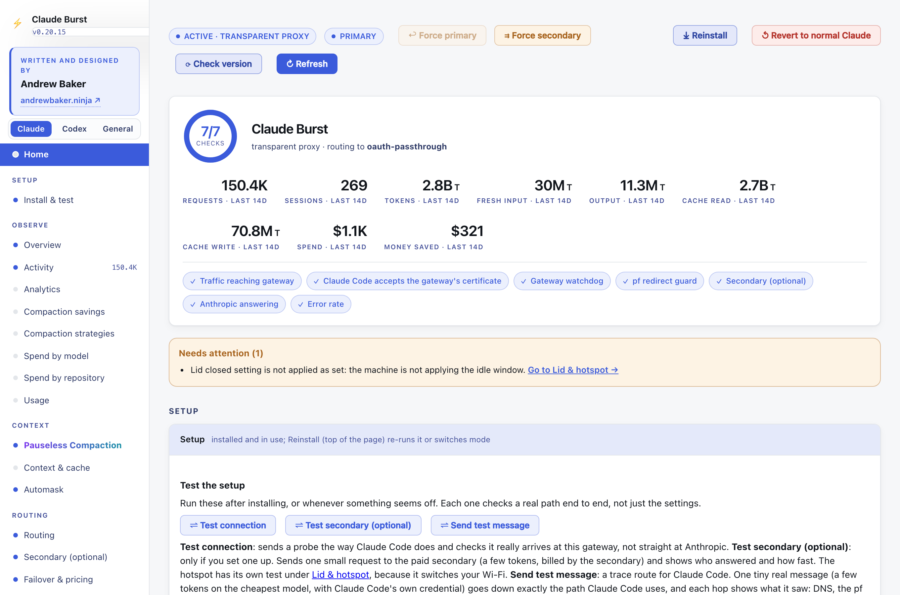

The menu down the left follows you as you scroll, grouped by job:

- **Observe**: Overview, Activity, Analytics (latency and error rate), Spend by model, and **Spend by repository** (each session filed under the repository its Claude Code transcript says it ran in).
- **Context**: [Pauseless Compaction](#pauseless-compaction-compact-sessions-without-the-pause-leading-edge), Context & cache.
- **Routing**: failover strategy and intercept mode, Secondary, [Failover & pricing](#failover--pricing).
- **Sessions**: [Session handover](#session-handover-handoffmd-read-at-start-written-at-close-optional), [Session coordination](#session-coordination-several-sessions-one-working-tree-optional), [Session options](#session-options-and-the-usage-panel), [Usage panel](#session-options-and-the-usage-panel).
- **This Mac**: [lid closed and hotspot](#keeping-claude-code-working-with-the-lid-shut-optional), [Notifications](#notifications).
- **Health**: Guards, Actions, Advanced (timeouts and limits).
- **Requests**: Responses and Requests, the audit trail of recent traffic.
- **Setup**: Install (shown when Burst is not in use, or from **Reinstall**).

The page follows the same order, most used first, and the menu marks the section you are reading.

Every control section says where it is saved and when it applies, as a chip beside its title: **applies at once**, **applies to the next session**, or **applies after a restart**. Settings the gateway only reads at startup (pricing, fallback models, failover thresholds and strategy, intercept mode, the secondary, timeouts and limits) are compared with the running gateway, and a banner at the top lists any that are saved but not yet in use, with a **Restart the gateway now** button.

A **Needs attention** list above the overview collects everything not doing what it is set to do, each linking to its section: a guard not running, handover hooks half installed, the lid setting not applied as set, another program keeping the Mac awake, a failed usage panel install or removal, and models served without a price.

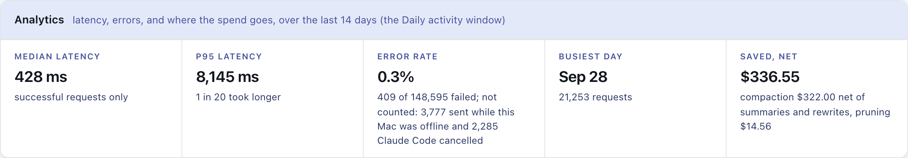

Screenshots are of a real dashboard with session ids, repository names and dollar figures replaced.

## Supported providers

Primary and secondary are independent, pluggable slots (`internal/router/provider.go`), nothing here is tied to one vendor:

| Slot | Options |
| --- | --- |
| **Primary** | `oauth-passthrough` - your existing Claude Pro/Max subscription login (the default, and the setup this whole README describes first) · `anthropic-api-key` - a direct, metered Anthropic API key, for accounts with no subscription |
| **Secondary** | `openai-compatible` - **Together AI** (the worked example, serving GLM), OpenRouter, or any other OpenAI-compatible chat-completions endpoint · `bedrock` - Amazon Bedrock · `none` - disable overflow entirely |

Bedrock speaks Anthropic's Messages format natively and is relayed byte-for-byte. The OpenAI-compatible providers go through a translator in both directions.

See [Together AI, OpenRouter or any OpenAI-compatible secondary](#together-ai-openrouter-or-any-openai-compatible-secondary) for the worked examples, and [Configuration](#configuration) for every field.

**Keeping Remote Control.** Pointing Claude Code at any local gateway normally costs you its Remote Control feature, Claude Code disables Remote Control the moment `ANTHROPIC_BASE_URL` names anything other than `api.anthropic.com`, and the default setup below sets exactly that variable. Claude Burst's `transparent` intercept mode solves this by never touching `ANTHROPIC_BASE_URL` at all: instead of using that config mechanism, it gets into the path a level lower, at DNS, so Claude Code's own settings never change and it believes it is still talking to `api.anthropic.com` directly. See [Keeping Remote Control: transparent intercept mode](#keeping-remote-control-transparent-intercept-mode-optional) below.

## Pauseless compaction: Compact Sessions without the Pause (Leading Edge)

**Claude Code's `/compact` stops the session while it summarises. Burst's compaction never does.**

**What is pauseless compaction?** Claude Code has no pauseless compaction mode of its own: its `/compact`, and the auto-compact near the end of its context window, stop the session while the conversation is summarised. Pauseless compaction is Claude Burst's alternative. A local gateway between Claude Code and Anthropic writes the summary in a background request while you keep working, then swaps it in on your next prompt. Claude Code is unchanged, your place in the conversation is kept, and there is nothing to type: it fires by itself, or on demand with [`/compact-async`](#compact-now-compact-async). Turn it on in the dashboard under **Pauseless Compaction**.

**You see it in Claude Code itself.** A line appears under the prompt you send, for example `⚡ Claude Burst, pauseless compaction: done. Context down 88%, 666k → 78k: 1074 earlier messages now go as a summary`. There are lines for when a summary starts, when it is ready, when it has cut the context, and when it fails or no longer fits. They come from a hook the dashboard installs (on by default, with a switch): under each prompt (`UserPromptSubmit`), and after each tool call inside a long turn (`PostToolUse`). A summary that is ready mid-turn waits for your next prompt, and the hook says so once, so a long turn never looks like compaction has not fired. Claude does not see these lines, so they cost no context.


On the subscription every turn re-reads the whole conversation, so a turn at 400k tokens costs about four times one at 100k and uses up your limits four times as fast. Claude Code only compacts near the end of its 1M window. With pauseless compaction on:

- When a session's context passes **Compact at** (default 400k), Burst sends one background request, on your subscription with the session's own login, asking the same model to summarise everything before your latest prompt. It takes about 40 seconds and you keep working.
- The summary request resends the history exactly as Claude Code last sent it, so it reads from cache rather than paying for the whole context again.
- From your next prompt, Burst sends the summary in place of those messages. Claude Code keeps its full local history and sees no difference. CLAUDE.md and other session context are carried over word for word. Thinking from before the summary is dropped, as Anthropic requires when history changes.
- `/clear`, `/compact` or a rewind make the summary stop fitting, and requests then go through untouched.
- A session is compacted at most once per window (default 60 minutes), a warning is logged at **Warn at** (default 300k), and state survives a gateway restart. A summary that fails is retried after 5 minutes, and a summary that stops fitting reopens the window at once, so a session is never left on its full history for the rest of the hour.
- **Limit:** Claude Code never learns that Burst shortened the history, so its own copy keeps growing. If Burst's summary stops fitting after that copy has passed the 1M window, the full history is too big to send: Anthropic refuses it and Claude Code compacts in its own way, with the pause. The gateway log says which message changed, so the cause can be found.

**What it did in its first day** (one long Opus 5.5 session, 2026-09-29 to 30): three summaries, the biggest drop 611k tokens to 49k with recall intact. Over 306 requests that is **$25.12 saved net**: $30.57 of context compacted, less $5.27 for the summaries and $0.19 for cache rewrites. The first two summaries cost $2.10 and $2.96 because they did not read the session from cache; the fix brought the third down to **$0.21**.

### Compact now: `/compact-async`

**`/compact-async` is `/compact` without the pause.** Type it in Claude Code whenever you want the context cut, instead of waiting for **Compact at**.

| | `/compact` (Claude Code) | `/compact-async` (Burst) |
|---|---|---|
| While the summary is written | session stops, you wait | you keep working |
| When it takes effect | when it finishes | at your next prompt after it is ready (about 40s) |
| Context size needed | any | any; ignores **Compact at** and the 60 minute window |
| What Claude Code keeps | the summary only | its full local history; only what is sent is shortened |

What happens:

1. You type `/compact-async`. Burst sees the command's marker in the prompt and starts the background summary of everything before it.
2. Claude replies with one line, `Pauseless compaction started: it swaps in with your next prompt, keep working.`, and uses no tools.
3. Keep working. Under your next prompt, the Burst line says what happened, for example `/compact-async: 812 earlier messages (context 214k) are being summarised in the background`.
4. The first prompt after the summary is ready carries it, and its line reports the drop, for example `Context down 80%, 214k → 43k`.

Good to know:

- **Installed for you.** The dashboard writes `~/.claude/commands/compact-async.md` while Pauseless Compaction is on and deletes it when it is off. It shows in Claude Code's `/` menu beside `/compact`. A `compact-async.md` of your own is never overwritten or removed.
- **One at a time.** Asking again while a summary is being written, or is ready and waiting, starts nothing new; the prompt line says which.
- **Needs something to summarise.** At the very start of a session there is too little before the prompt, and the prompt line says so instead.
- **Only your prompt triggers it.** The marker inside a file Claude reads, or any other tool output, is ignored.
- **Cost:** one summary request on your subscription, read from cache, typically about $0.20 API-equivalent (see [the savings](#how-the-savings-are-calculated)).

### How the savings are calculated

A compacted request does not record what it would have sent without Burst, so the dashboard works it out by replaying each session from `metrics.jsonl`, request by request, beside a **"without Burst" twin**:

- **The twin grows as the session grows.** On every request the twin's context changes by exactly as much as the real one, except that it never takes Burst's drops.
- **Claude Code compacts the twin.** Without Burst the session would not grow past the 1M window: Claude Code compacts on its own near the end of it. When the twin reaches **950k** (95% of the window; Claude Code does not publish its exact threshold), it is compacted back down to the size of one of Burst's summaries. So fifteen compactions never claim fifteen windows of saving, and just after the twin has been compacted it can be smaller than the real session; those requests count **against** Burst.
- **Saving per request** = twin context minus real context, priced at the model's cache-read rate (in a long session every resent token is a cache read).
- **Net saving** = the sum of those, less every summary call, less the extra cost of writing each shortened history to cache on the request after a swap (where the twin would only have read). The twin's own compactions by Claude Code are not credited back, so the net figure errs low.
- All figures are API-equivalent: on a subscription the real effect is using your limits more slowly, not a smaller bill.

The dashboard shows the net figure in the Pauseless Compaction section (per session, with the parts on hover), in the **Saved, net** tile under Analytics, and per day in the Saved chart's tooltip. The same explanation is on the page under *How the savings are calculated*.

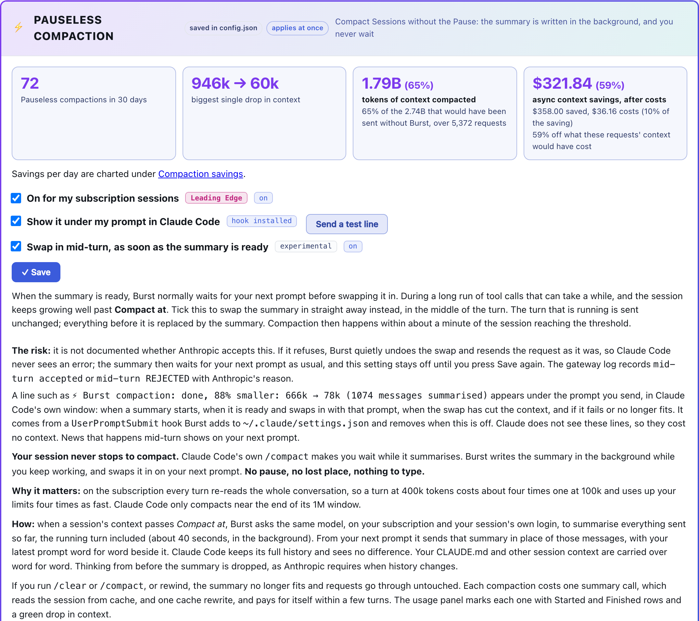

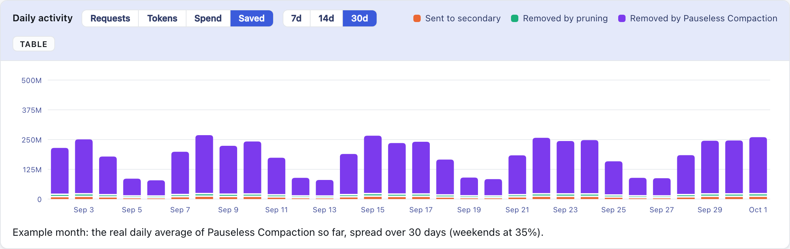

The Saved view above is also an example month: the real daily average so far (2026-09-29 to 10-01, about 195M tokens of context compacted per active day) spread over 30 days, weekdays varying by a fixed pattern and weekends at 35%.

### Savings per day, and what a month looks like

The Pauseless Compaction section charts each day: **savings** (context compacted, priced at what resending it would have cost) above the line, **cost** (the summaries and the cache rewrites after each swap) below it, on one scale. The header totals the net for the window, hovering a day shows the breakdown, and *Show as a table* lists every day.

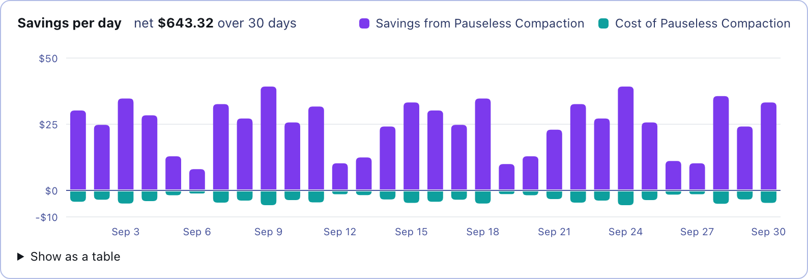

**An example month, from the current data.** The chart above is not a real month: it is the first two real days of Pauseless Compaction (2026-09-29 and 30, one person, long Opus 5.5 sessions in Claude Code) repeated over 30 days. Each weekday varies by a fixed pattern around the real daily average and weekends run at 35%.

| | Real, per active day | Example month (22 weekdays, 8 weekend days) |
|---|---:|---:|
| Savings: context compacted | $30.19 | $749.87 |
| Cost: summaries | -$3.42 | -$84.95 |
| Cost: cache rewrites | -$0.87 | -$21.61 |
| **Net saved** | **$25.90** | **$643.32** |
| Compactions | 6 | 150 |

- Cost comes to about 14% of the savings, so roughly 86 cents in every dollar of context compacted is kept.
- These are API-equivalent dollars. On a Max or Enterprise subscription the bill does not change; the saving is your usage limits lasting longer, because each turn re-reads a shorter context.
- Your figure depends on how long your sessions run. A session that never passes **Compact at** (default 400k) is never compacted and saves nothing; the savings come from long sessions, and grow with them.
- Two days is a small sample. The dashboard shows your own numbers over the last 7 days as soon as a session has been compacted.

**Where to see it:**

- **Dashboard, Pauseless Compaction** (its own entry in the menu): the on/off switch and thresholds, headline figures for the last 7 days, and a table of sessions with context **before** and **after** the latest summary, the **saving per turn**, and the **net saving** after summaries and cache rewrites.
- **Dashboard, Daily activity, Saved:** the tokens compaction removed (context compacted), stacked with what overflow pruning removed, per day. The tooltip shows what each saved and what the summaries cost.
- **[Usage panel](https://github.com/andrewbakercloudscale/claudecode-cost-usage-panel):** Started and Finished rows in the turn table, a green negative context delta on the turn where the summary landed, and the summary's cost in the session total.

## Keeping Claude Code working with the lid shut (optional)


Off by default. `keep_awake_lid_closed` in `config.json` keeps a Claude Code session in Ghostty running, and Remote Control reachable, after you close the lid. `keep_awake_lid_closed_power` picks when:

| `keep_awake_lid_closed_power` | Lid shut, plugged in | Lid shut, on battery |
| --- | --- | --- |
| `ac` **(default)** | stays awake | sleeps as normal |
| `always` | stays awake | stays awake |

**Only while in use** (`keep_awake_idle_minutes`, 0 by default): either mode can be limited to a set time after you last used it, so a session you walked away from does not keep a closed laptop awake all night. "Used" is a Claude Code turn (from the Mac or from your phone through Remote Control) or the lid being open. Once the time passes, closing the lid sleeps the Mac as usual; opening it wakes the Mac, starts the time again, and tries the hotspot at once if there is no network. The dashboard offers 30 minutes to 8 hours and shows until when the Mac stays awake. The gateway touches `~/.config/claude-burst/last-activity` on each turn, and the root daemon, which checks every minute, reads only that file's time and only at that path.

```bash
claude-burst configure --keep-awake-lid-closed true                 # mode ac
claude-burst configure --keep-awake-idle-minutes 60                 # awake for an hour after last use
claude-burst configure --keep-awake-power always                    # switch mode
claude-burst configure --keep-awake-lid-closed false                # undo
sudo scripts/lid-awake-root.sh apply ac                             # printed for you if sudo is not cached; ./install.sh re-applies it from config.json
```

- **`pmset -a disablesleep 1`** (root), the only switch that overrides clamshell sleep; `caffeinate` and `pmset sleep 0` do not. The prior value is recorded and restored by `remove`.
- **Mode `ac` needs a root LaunchDaemon** (`ninja.andrewbaker.claude-burst-lidawake`): SleepDisabled is one global value with no per-power-source form, so the daemon follows `pmset -g pslog` and sets it on plug-in and unplug. It runs a root-owned copy in `/usr/local/libexec/claude-burst`; re-run `apply` after editing the script. Log: `/var/log/claude-burst-lidawake.log`.
- **The screen goes off behind the shut lid.** Keeping the Mac awake also kept the built-in screen lit behind the lid, using power and warming it for nobody. Within about 5 seconds of the lid shutting, the daemon turns the display off (`pmset displaysleepnow`: display sleep only, Claude Code keeps running), and again if anything wakes it. Not while an external monitor is connected, since that is clamshell mode with someone at the monitor. The daemon therefore runs in both modes. Log: `/var/log/claude-burst-lidawake.log` ("screen off").
- **Ghostty App Nap off** (`NSAppSleepDisabled`, no root), with the lid shut every window is occluded, which is when macOS throttles the app. Takes effect on Ghostty's next launch.
- `claude-burst status` shows the flag, the mode, the power source and the machine's actual state, and flags drift either way.

With `always`, a closed laptop never sleeps: on battery in a bag that means heat and a flat battery. That is why `ac` is the default.

`./install.sh` applies whatever `config.json` says (nothing at all when `false`), and `./install.sh uninstall` removes the daemon and restores the prior sleep setting. Check it is live with `claude-burst status`:

```text
keep awake lid closed: on, mode ac (now on AC: SleepDisabled on, Ghostty App Nap disabled on)
```

Any line starting `->` beneath it is drift, with the command that fixes it.

**From the dashboard** (This Mac, Lid & hotspot): select **Off**, **Plugged in only** (`ac`) or **Plugged in and on battery** (`always`, asks you to confirm), then click **Apply**; selecting alone changes nothing. Apply saves `config.json`, sets Ghostty's App Nap, and applies the root half with cached sudo or in a Terminal window that asks for your password. It shows the live state (power source, battery, whether lid sleep is overridden) and anything not applied as set.

It also lists **other programs keeping this Mac awake**: any process holding a `PreventSystemSleep` assertion (for example `caffeinate -s`) keeps a closed laptop awake on battery whatever this setting says. The idle assertions `caffeinate -i` takes, which Claude Code holds, do not, so they are not listed.

### Join a hotspot when offline

With the lid shut macOS does not join a phone's hotspot by itself (Instant Hotspot is driven from the Wi-Fi menu while someone is at the Mac), so a session left running loses the internet when you leave home Wi-Fi. Off by default.

- **Pick the network** from a dropdown of the networks this Mac has joined before (`networksetup -listpreferredwirelessnetworks`). Join the hotspot once by hand first, so macOS has its password.
- **When**: only with the lid shut (default), or any time this Mac is offline.
- **Offline means unreachable**, not "on the wrong network": a TCP connect to `1.1.1.1:443` and `8.8.8.8:443`, by address, so the `/etc/hosts` redirect does not affect it. The SSID is not checked because since macOS 14.4 `networksetup -getairportnetwork` reports "not associated" to processes without Location access even while connected.
- **Timing**, all on the dashboard under Timing, with a line that adds them up in words as you type:
  - **Check the internet every** 5 seconds (2 to 120).
  - **Failed checks before joining**: 2 (1 to 10), so the first try is about 10 seconds after Wi-Fi is lost.
  - **Gap between tries**: 60 seconds after each try ends (15 to 1800; below 15 a phone is hammered).
  - **Keep trying for**: 30 minutes from the first try (up to 1440). The last try that fits turns Wi-Fi off and on if the Mac is still offline. It starts over once the Mac is back online.
  - The watcher re-reads these at every check, so Save applies them with no restart.
- **Opening the lid with no network** tries the hotspot at once, whatever **When** says and even after the watcher has given up, then starts a fresh spell.
- **If the phone's mobile data drops** while the Mac is still joined to its hotspot (an iPhone hotspot address, 172.20.10.x), the watcher waits rather than joining again: a join would drop the Mac off the phone, and an iPhone with nothing connected stops broadcasting.
- **If the hotspot itself drops**, the watcher starts again within about 10 seconds. It can only rejoin while the phone is broadcasting: an iPhone hides its hotspot once nothing is connected and its Personal Hotspot screen is closed, and every try then fails with "Could not find network" until the phone shows it again.
- **Password**: required, stored in the login Keychain as service `claude-burst-hotspot`. Without it macOS refuses a join made by a background process (error -3900) even for a network it knows, so Save refuses a network with no password. **Show** beside the field unmasks a typed password, or reads the stored one after Touch ID, to check it by eye. The field is not a browser password field, so Chrome does not offer to save it.
- **On an iPhone**, turn on **Allow Others to Join** in Personal Hotspot, or the network is not visible to a Mac nobody is using.
- **Test: join it now** opens a checklist of what to set on the phone first, and will not start without a password. The test then tries up to **3 times**, 5 seconds apart, showing each attempt as it happens, to join the network selected in the dropdown, saved or not, and reports each step: the join, internet through it, and after a failure getting back on a network (Burst turns Wi-Fi off and on if macOS has not rejoined within ten seconds). Failures say what to do: not found means the phone is not broadcasting; error -3900 usually means a wrong password, so press Show to check it.
- Log: `~/.config/claude-burst/hotspot.log`, also shown on the page.

### Notifications

macOS notifications (through `osascript`) for events worth knowing while you look elsewhere, each switched on separately in **This Mac, Notifications**:

- **Failover**: requests move to the paid secondary, and again when they come back.
- **Compaction**: Pauseless Compaction swapped a session onto its summary.
- **Guards**: the pf guard or the gateway watchdog repaired something, or removed the redirect.

Starting the gateway announces nothing already true. `config.json` is read live, so no restart.

## Session handover: HANDOFF.md read at start, written at close (optional)

Two Claude Code hooks, installed and adapted from the dashboard's **Session handover** section. They only act in a repo whose git root has a `HANDOFF.md`: create one (even empty) to opt a repo in.

- **SessionStart** (new session or `/clear`): Claude is given a briefing, the newest handover section, the commits since `HANDOFF.md` last changed, `git status` and the repo's layout, and told to skim the code it names before answering.
- **SessionEnd** (`/exit`, Ctrl-D, `/clear`, or closing the Ghostty window, which Claude Code reports as reason `other`): a detached job (`setsid`, so the window's SIGHUP cannot kill it) resumes a fork of the finished session with the writer model, has it prepend a dated section to `HANDOFF.md`, and commits that one file locally. It never pushes. Sessions with fewer typed prompts than the minimum are skipped, and so is a session with nothing worth handing over. A macOS notification says when it is done.

The dashboard edits the briefing text, the writer's instructions, the writer model, the minimum prompts and whether to commit, and shows the log. Settings: `~/.config/claude-burst/handover.json` (defaults stored as empty, so they follow new defaults). Scripts, the settings they read, the log and the writer's last reply: `~/.config/claude-burst/handover/`. The scripts are embedded in the binary and rewritten when they differ, so edit `internal/handover/scripts/`, not the installed copies.

**Cost**: the writer re-reads the whole session, so a long session costs about one more turn of it. Pick a cheaper writer model to spend less.

## Session coordination: several sessions, one working tree (optional)

**Several Claude Code sessions can edit the same files without losing or sweeping up each other's work, and nobody waits.** Off by default; switch it on in the dashboard under **Session coordination** (Leading Edge).

Two sessions in one repository go wrong in a few ways: one rewrites a file over the other's uncommitted change, one commits with `git add -A` and ships the other's half-done work, or one stashes or resets under the other. Coordination prevents those with Claude Code hooks (seven: SessionStart, PreToolUse, PostToolUse, UserPromptSubmit, Stop, SubagentStop, SessionEnd), so every session on the Mac takes part without being asked.

The design rule is that **nobody waits on anybody**. There are no locks: edits always go through. Instead, commits are accelerated: a session holding uncommitted work that another session needs is told to commit it now, ahead of its own work, as "WIP:" if its part is unfinished. A small early commit is cheap; a session sitting idle behind a lock is not.

- **The first session to edit a file is its master, and commits it.** That is the only session that commits it.
- **Another session can still edit it, with no wait.** Claude Code's Edit replaces an exact piece of text and refuses when the file changed since it was read, so two sessions' edits cannot overwrite each other. The change goes through; the master is told what changed and asked to commit the file at its very next tool call, ahead of its own work (as "WIP:" if its part is unfinished), so nobody's change waits behind another session's; the other session is told the file is shared and not to commit it.
- **What is refused:** a whole-file Write over a master's uncommitted work (use Edit instead); a git add or commit by another session that names a file someone else masters; `git add -A`, `git add .`, `git add -u` or `git commit -a` while another session has uncommitted work in the same repository; and, for the same reason, running a deploy or install script there (`deploy*.sh`, `install.sh`), which builds the working tree and would ship that work in no commit. A refused call is not run, and the session is told why and what to do instead. For a deploy, the sessions holding the uncommitted work are asked to commit it at once, and the deploying session is told to carry on with other work and run it again once they have, or to use `scripts/deploy.sh --only-committed`, or, only on your say-so, prefix `SHIP_UNCOMMITTED=1`.
- **Every deploy says what it ships that git does not hold.** `scripts/deploy.sh` and `install.sh` build the working tree, so they list any uncommitted files they are about to ship and keep a copy (patch plus untracked files) in `~/.config/claude-burst/shipped-uncommitted/`, whether coordination is on or not. `scripts/deploy.sh --only-committed` ships exactly HEAD instead.
- **A session commits before it stops.** A turn that would end with files its session masters uncommitted is held once, with the instruction to commit them now: locally only, never pushed, and with "WIP:" in the message if the work is unfinished. A second stop in the same turn is let go, so a commit that cannot be made never keeps a session going round. This is what makes handing a file on safe: whoever takes it next finds it committed.
- **Subagents are not mistaken for their session.** A subagent (the Agent tool, often in the background and in its own worktree) runs its hooks with its parent session's id, so its edits used to read as the session's own, and the session was held at the end of its turn to commit files the agent was still writing. Hook calls from inside a subagent also carry an `agent_id`: coordination now records which subagent last edited each file, keeps each session's running subagents (added at their first tool call, removed by the SubagentStop hook, and counted as finished after 2 hours of silence in case that never arrives), and leaves a running subagent's files out of the end-of-turn check. Once the agent finishes, its files are the session's to commit.
- **Every session is briefed when it starts:** the rules, and which other sessions are active, in which folders, mastering which files.
- **A file stops being shared when it is committed.** A file git keeps no record of (outside a repository, or ignored, like memory files) is let go when its master's turn ends. A master that has been idle for 15 minutes keeps its files until another session needs one: that session's Edit makes it the master, it is told it now commits the file (and to keep any uncommitted changes in it), and the old master is told it lost it. A session can ask a busy master for a file with `claude-burst coord take <path> --session <id>`; the file is its when the master commits, releases or closes. A master that closes hands each file to the session that asked for it, else the one that most recently changed it too. Editing a file that already has uncommitted changes nobody recorded (by hand, or by a session that ended) warns the editor to keep them. A master sitting on other sessions' changes for 10 minutes is nudged to commit. Both times are settings.
- **Sessions can message each other:** `claude-burst coord send <session> "message"`; it arrives at that session's next tool call or prompt. `claude-burst coord status` shows who masters what from the terminal.
- **The dashboard shows who is editing what:** each file with its master (by session name, folder, id and the latest request typed in it, since sessions in the same folder share a window title), the sessions coordinating with that master, every session taking part, and a log of what the coordinator did (shares, refusals, hand-ons, files freed by a commit). **Message** sends a session a note from you; **Hand on** passes a file on as if its master had closed.
- **Is it working?** The dashboard counts what coordination did over **Today, 7 days or 14 days**, and lists what went wrong under **Issues**. See [Is it working? Metrics and Issues](#is-it-working-metrics-and-issues) below.
- **Scratch files are ignored.** Files under temporary directories (session scratchpads, `/tmp`, `/var/folders`) are never tracked: only the session that made them edits them.
- **It fails open.** If anything in it breaks, including its state lock being busy for 3 seconds, the tool call goes through as if coordination were off.

### How it fits together

Every hook call follows the same path. It never makes a session wait: at worst it gives up and lets the call through.

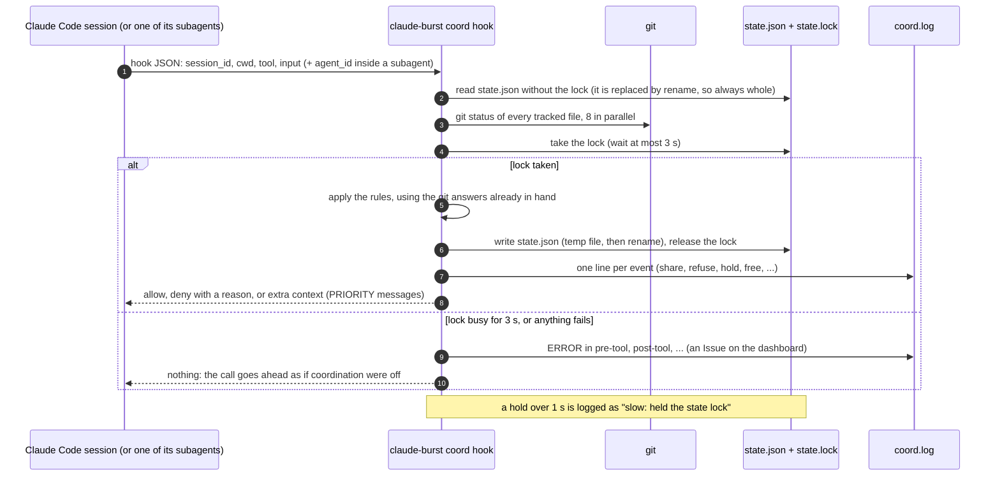

Two sessions editing one file. Nobody waits: the second edit goes through, and the master commits it first.

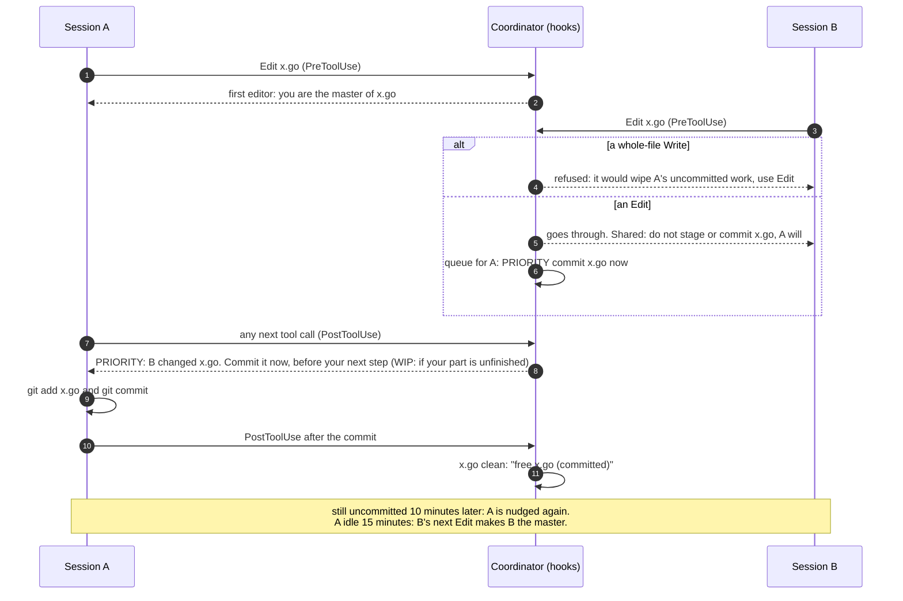

A deploy while another session has uncommitted work in the same repository:

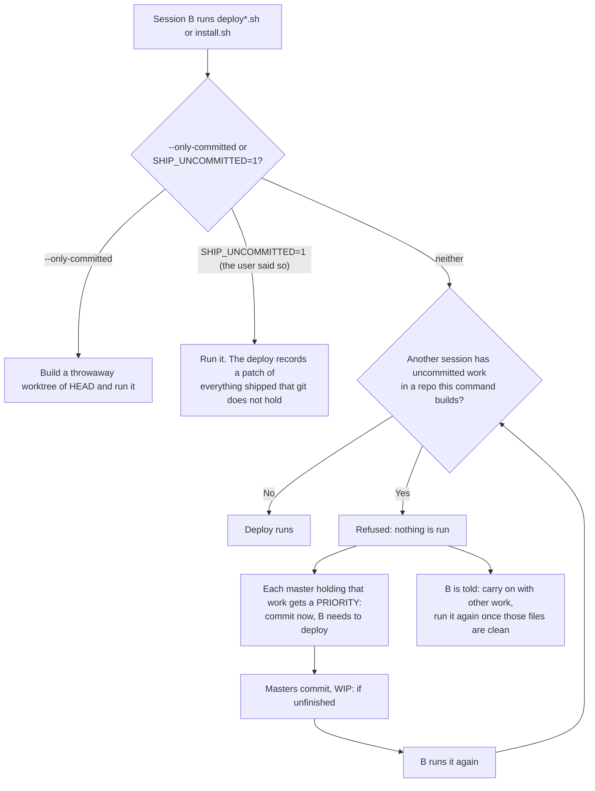

The end of a turn, with background subagents:

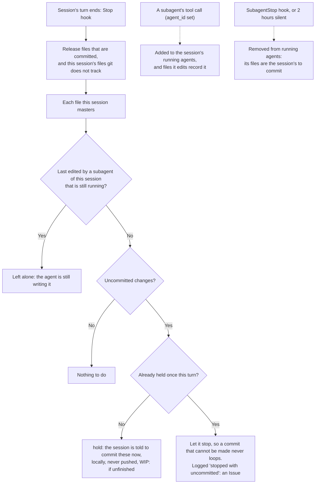

### Is it working? Metrics and Issues

Everything coordination does is one line in `~/.config/claude-burst/coord/coord.log` (local time). The dashboard's **Session coordination** section counts those lines; nothing else is stored, so the counts reach back to the day coordination was first switched on. Pick **Today**, **7 days** or **14 days** at the top.

| Tile | Counts log lines | What it tells you |
|---|---|---|
| **Coordinated** | all of the next four together, plus `asks ... for` | times two sessions actually met over the same work. 0 means it has had nothing to do yet, not that it is broken |
| **Shared edits** | `share <file>: <B> edits, master <A>` | a session edited a file another session masters, and it went through |
| **Blocked** | `refuse ...` | a whole-file Write, `git add -A`/`commit -a`, staging someone else's file, or a deploy over others' work was stopped |
| **Taken over or handed on** | `master of <file> taken over by ...` / `passes from ...` | a file moved to another master: its master was idle, ended, or was handed on |
| **Asked to commit** | `hold <session> to commit ...` | a turn ended with mastered files uncommitted, and the session was told to commit them |
| **Stopped uncommitted** | `<session> stopped with uncommitted ...` | the session ended the turn anyway (the second stop is always let go). Amber when above 0 |
| **Hook errors** | `ERROR in <hook>` / `PANIC in <hook>` | coordination failed on one tool call, which went ahead uncoordinated. Red while one is open |
| **Released after commit** | `free <file> (...)` | a file stopped being shared because it was committed, or because git does not track it |

Each tile shows the count for the chosen window and, under it, the all-time count. With 7 or 14 days a per-day table follows, newest day first.

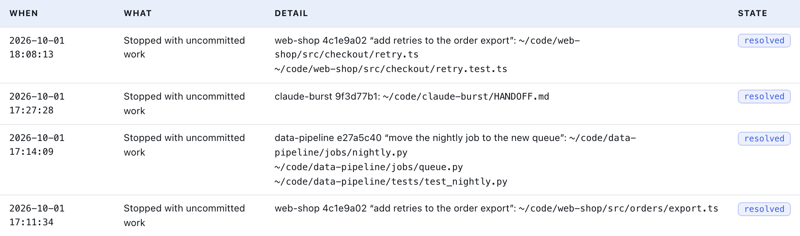

**Issues** lists what went wrong in the chosen window, newest first:

- **When** is the time of the log line.
- **What** is one of two kinds:
  - **Stopped with uncommitted work**: a session's turn ended twice in a row with files it masters still uncommitted. The first stop was held with the instruction to commit; the second is always let go, so a commit that cannot be made never keeps a session going round.
  - **Hook error**: a hook failed (for example `state lock: resource temporarily unavailable`, when it waited 3 seconds for the state lock) and the tool call went ahead as if coordination were off.
- **Detail** names the session and the files:
  - the session's folder and short id (`wordpress-cyber-devtools ef7f6a74`), then, in quotes, the **latest request of five words or more typed into that session now** (not at the time of the issue). Sessions named after their folder share a window title; this is how you tell them apart. A session that has ended shows its id alone (`e2738352` above).
  - each file it had left uncommitted, and, while the issue is open, how many are still uncommitted.
- **State** is **open** or **resolved**:
  - A stopped-uncommitted issue is resolved once every one of its files has been committed or handed to another session. The log is checked first (a later `free` or hand-on line for the file); every file still pending is then checked against git directly, because a file can stop being tracked without a log line, for instance when it was committed in an agent's worktree that was then merged.
  - A hook error has nothing in the log to resolve it, so it is open for 24 hours and then shows as resolved. **Clear hook errors** (shown while one is open) deals with them sooner: it writes a marker line to the log, and every error before it leaves the list, though it stays in the counts.
- While anything is open, the summary beside the heading says how many, and the **Session coordination** menu item shows a red dot.

Reading the example above: every row is the same pattern from the afternoon of 2026-10-01, before subagents were recognised. The cyber-devtools session ran several background agents, each in its own worktree under `.claude/worktrees/agent-...`. Their edits carried the session's id, so when the session's turn ended, coordination asked it to commit the agents' files; the session rightly left them to the agents and stopped, and each stop became an Issue. All resolved once the agents committed and their worktrees were merged. Since then a running subagent's files are left out of the end-of-turn check, so this pattern no longer produces Issues.

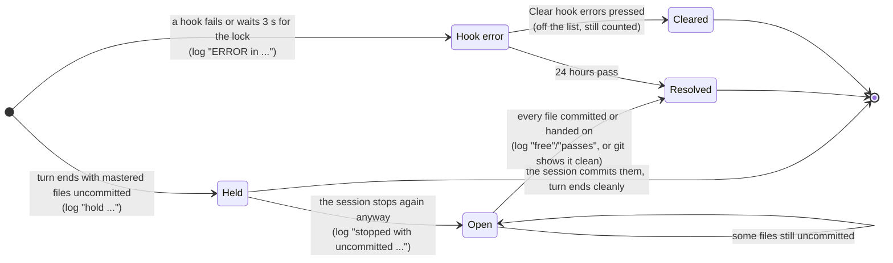

What it cannot do: stop an edit made through a shell command (sessions are told not to, and Claude Code follows that), or keep sessions sharing a working tree from seeing each other's uncommitted changes. For large parallel pieces of work, `claude --worktree` gives each session its own copy; this covers the shared-tree case.

## Session options and the usage panel

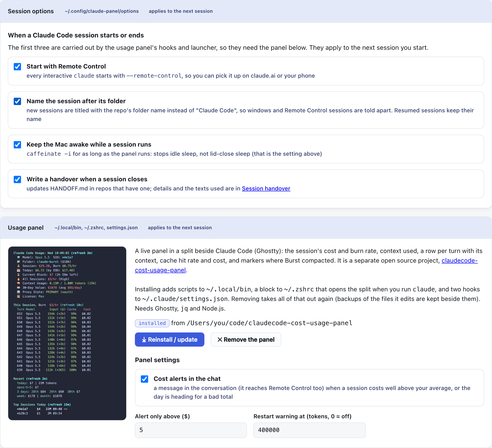

**Session options** (Sessions menu) apply to the next session you start. The first three are carried out by the [usage panel](https://github.com/andrewbakercloudscale/claudecode-cost-usage-panel)'s hooks and launcher, so they need it installed, and are saved in `~/.config/claude-panel/options`:

- **Start with Remote Control**: every interactive `claude` starts with `--remote-control`.
- **Name the session after its folder**: new sessions are titled with the repo's folder name instead of "Claude Code". Resumed sessions keep their name.
- **Keep the Mac awake while a session runs**: `caffeinate -i` while the panel runs. Stops idle sleep, not lid-close sleep.
- **Write a handover when a session closes**: the same switch as in [Session handover](#session-handover-handoffmd-read-at-start-written-at-close-optional).

**Usage panel** (Sessions menu): a live panel in a Ghostty split beside Claude Code, showing the session's cost and burn rate, context used, a row per turn with its context, cache hit rate and cost, and where Burst compacted. The section explains what it installs and shows a masked screenshot.

- **Install** runs the panel's `claude-panel-setup.sh` from a checkout beside this repo, cloning it first if there is none. It adds scripts to `~/.local/bin`, a block to `~/.zshrc`, and two hooks to `~/.claude/settings.json`.
- **Remove** (click twice to confirm) runs the panel's `claude-panel-uninstall.sh`, which takes all of that out and keeps backups of the files it edits. Removing it also turns off the three session options above.
- One install or removal at a time; its output is shown on the page.
- **Panel settings**: cost alerts in the chat (on or off), the minimum dollar amount before a session alert fires, and the context size that shows a red restart warning (0 turns it off).

## Failover & pricing

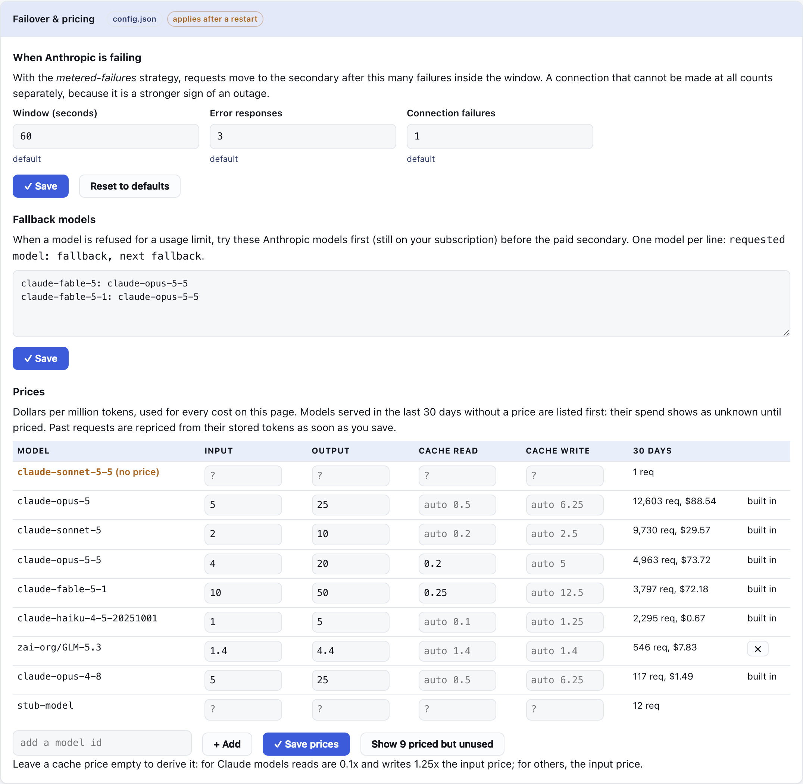

Routing menu, saved in `config.json`, applies after a restart (the banner offers it):

- **When Anthropic is failing**: the `metered_failover` window, error responses and connection failures, each marked when changed from its default, with **Reset to defaults**.
- **Fallback models**: `fallback_chain`, one line per model (`requested model: fallback, next fallback`), tried on your subscription before the paid secondary.
- **Prices**: every model with a price, plus every model served in the last 30 days, **unpriced models first**, with requests and spend per model. Add, edit or remove a price (a built-in price can only be reset to its built-in value, since built-ins are merged into every load; an empty cache price is derived from the input price); past requests recorded as unpriced are repriced from their stored tokens once saved.

**Advanced** (Setup menu, collapsed): `reset_grace_seconds`, `unknown_reset_seconds`, `response_header_timeout_seconds` and `max_request_mb`, each marked when changed from its default. The gateway and dashboard addresses and TLS peer logging are shown read only: they change what Claude Code connects to, so they are set with `claude-burst configure` and a reinstall.

## Why this exists

Anthropic exposes materially different commercial models for access to the same Claude model families:

- Claude Max is a fixed monthly subscription with rolling usage limits.
- Claude API is metered by token.
- Together AI, OpenRouter and Amazon Bedrock all offer metered access to Claude-family or comparable models outside Anthropic's own billing.

Anthropic's Claude Code gateway documentation explicitly supports `ANTHROPIC_BASE_URL` with an existing claude.ai subscription login. Setting only the base URL keeps the subscription credential active and the subscription's usage limits and billing continue to apply. Claude Burst uses that supported gateway mechanism and respects the subscription limit rather than trying to evade it.

## Routing behaviour

1. Claude Code sends `/v1/messages` to `http://127.0.0.1:7777`.
2. Claude Burst forwards the request to `https://api.anthropic.com` unchanged, including the user's saved Claude subscription OAuth credential and required beta headers.
3. Successful responses stream straight back to Claude Code.
4. Generic `429` responses do **not** trigger overflow.
5. Overflow activates only when Anthropic's subscription headers indicate a rejected unified limit, for example `anthropic-ratelimit-unified-status: rejected`, or when an explicit subscription-limit error is returned.
6. Claude Burst reads Anthropic's reset timestamp and persists it against **the model that was refused**, not the account.
7. The rejected request is replayed down that model's `fallback_chain` first, another Claude model, still on the subscription, still free.
8. Only when every rung has a rejection window of its own does the request go to the configured secondary, Together AI, OpenRouter, any other OpenAI-compatible endpoint, or Amazon Bedrock, using a credential stored in macOS Keychain.
9. Later requests for that model skip straight to the rung (or the secondary) until the reset time plus a small safety grace period; other models are untouched.
10. The first request after that time goes back to Anthropic Max automatically.

### When the network itself is the problem

A laptop changing WiFi looks like an Anthropic outage from the inside, and failing over does
not help: the secondary is behind the same network. Three rules keep it from being treated as
one (all from the 2026-09-21 evening, when a hotspot-to-LAN switch put a healthy primary's
traffic behind a secondary that could not answer for five minutes):

- **A dead pooled connection is retried once, on a fresh one.** A `write: broken pipe` means
  the kept-alive connection died and the server never saw the request, so it is safe to resend
  and is not counted as a failure. Read-side resets are *not* retried: the server may already
  have run the request.
- **Silence while DNS is down does not fail over.** If the far side did not answer (a timeout,
  not a refused or reset connection) *and* the control lookup of `www.apple.com` fails, the
  request gets a fast, explicit 502 instead of waiting on a second dead host.
- **An outage window is short and releases itself.** A window armed by failures (as opposed to
  a rate limit) lasts `metered_failover.window_seconds` (60 s), not the 5-minute unknown-reset
  default, and ends the moment the secondary also fails at the transport level.

### Limits are per model, and are never inferred

Anthropic's claim headers name the *bucket* that was exhausted (`five_hour`,
`seven_day_opus`, `seven_day_overage_included`, …) but nothing in the response states which
**models** that bucket covers. Claude Burst does not guess: only the model that was actually
refused gets a window. If a limit really is account-wide, the next model discovers that for
itself on its first request, one rejection, which bills nothing.

Guessing the other way is what cost real money. Until 2026-09-20 any reported limit armed
one account-wide window, so a single refused Fable request sent **every** model to the paid
secondary for the next two days while Opus was answering normally.

`fallback_chain` in `config.json` is the ordered list of models to try on the subscription
before spending anything:

```json
"fallback_chain": {
  "claude-fable-5-1": ["claude-opus-5-5"],
  "claude-fable-5":   ["claude-opus-5-5"]
}
```

Those two are the shipped default. `claude-opus-5` → `claude-sonnet-5` works the same way
but is left for you to add deliberately, it is a much larger capability drop than a cost
saving justifies by default. A rung is skipped when it is inside a window of its own, and a
chain that names its own key is ignored rather than retrying the model that was just refused.

The dashboard's **Actions** section has a *Try another Claude model before the secondary*
toggle that turns the whole thing off live, without a config edit or a restart, and shows
which models are currently refused and where their traffic is actually going. `claude-burst
status` prints the same thing as `refused:` lines.

The forced window (`claude-burst force-secondary`, or **Force → secondary** on the
dashboard) is still account-wide and deliberately bypasses the chain: its only purpose is to
exercise the secondary, and quietly serving a different Claude model instead would defeat
the only test that path ever gets.

Only `/v1/messages` participates in any of this. Everything else, `count_tokens`, and
Claude Code's control-plane traffic such as Remote Control's long-poll and settings fetch -
always goes to the primary, never fails over, and does not feed the failover detector in
either direction. There is nowhere correct to send those: an OpenAI-compatible endpoint has
no equivalent of a Remote Control long-poll, and translating a `count_tokens` body would
bill a full generation to answer "how many tokens is this". Just as importantly, a dropped
long-poll is not evidence that inference is failing and must not be able to open a paid
overflow window, and a healthy long-poll is not evidence that it has recovered.

Claude Burst does not rotate Max accounts, suppress quota signals, fabricate headers, or attempt to extend the Max allowance. The subscription limit remains authoritative.

## What is logged

Claude Burst writes to two files under `~/.config/claude-burst/` - both rotate, so the pair is really up to 20 `claude-burst.log[.N]` files and 6 `metrics.jsonl[.N]` files, and both are metadata-only: **prompts, source code, tool inputs and model outputs are never written to disk.** The proxy necessarily handles the request body in memory so it can replay a rejected request to the secondary, but it does not persist it.

### `metrics.jsonl` - structured, one line per request

(Also note the model fields: `model` is what **served** the request and drives cost;
`requested_model` is what Claude Code asked for. They differ exactly when a remapping
provider, Bedrock's modelMap, or openai-compatible fixed/consistent failover, was
involved. Pricing uses the served model, so a request GLM served is never costed at
Claude Opus rates.)

- timestamp and a short request id (also present in `claude-burst.log`, so a line in one file can always be matched to the other)
- Claude Code session and agent identifiers
- the slot (`primary` or `secondary`) and the route that served it, `anthropic` for oauth-passthrough, `anthropic-api-key`, `bedrock`, or an openai-compatible secondary's vendor label (`together`, `openrouter`, whatever `keychain_service` names)
- `destination`: the actual outbound URL (scheme, host and path; no query). The slot label says which slot was *chosen*; this says where the request physically went, which is what settles "did that really go to the secondary?"
- model
- HTTP status
- latency
- input/output token usage where exposed in the SSE stream
- estimated API-equivalent cost using the prices in `config.json`. A model with **no** `pricing` entry costs `0` - so the event also carries `pricing_unknown: true`, and `stats` counts it separately, because a zero meaning "not priced" must not read as a zero meaning "free". Third-party secondary models are not in the default pricing table: add yours to `pricing` or its spend will not be counted
- subscription limit claim and reset timestamp when failover occurs
- a short note on what happened (e.g. "subscription limit detected; request replayed to secondary", "keychain load failed: ...")

### `claude-burst.log` - plain text, for debugging

Every request gets a `start` line and a matching `done` line (same request id, final HTTP status, duration), so you can always see what the gateway did even for requests that never made it into `metrics.jsonl`. In addition, every failure path logs which stage it failed at and why:

- reading or size-limiting the request body
- building the outbound request to Anthropic or the secondary
- the upstream HTTP call itself (network errors)
- loading the secondary's key from the environment/Keychain
- mapping a model name for the secondary (Bedrock `model_map`, or the openai-compatible target)
- reading or writing the local overflow-state file
- writing a metrics event
- a panic anywhere in the request path, recovered, logged with a stack trace, and turned into a `500` instead of crashing the gateway or hanging Claude Code's connection

A metrics-write failure (disk full, permissions, etc.) is logged but never fails the request itself, by the time metrics would be written, Claude Code has already been served.

## Requirements

- macOS on Apple Silicon or Intel
- Go 1.23+ (there's no prebuilt binary in the repo; `install.sh` builds one locally)
- Either: Claude Code already installed and logged into the intended Pro/Max account (subscription mode), **or** a metered Anthropic API key (no-subscription mode)
- A credential for whichever secondary you pick, one of:

| Secondary | Credential | Provider setting | Overflow |
|---|---|---|:---:|
| **Together AI** (worked example) | a Together API key | `--secondary openai-compatible` | yes |
| **OpenRouter** | an OpenRouter API key | `--secondary openai-compatible` | yes |
| **Amazon Bedrock** | Bedrock access + an API key in `AWS_BEARER_TOKEN_BEDROCK` | `--secondary bedrock` | yes |
| *(none)* | - | `--secondary none` | no |

The secondary is a pluggable slot (`internal/router/provider.go`), not a hardcoded vendor. The two families differ in one way worth knowing up front. Bedrock speaks Anthropic's Messages wire format natively, so its responses are relayed byte-for-byte, while Together AI and OpenRouter go through the OpenAI-compatible translator (`internal/router/provider_openai.go`) in both directions, streaming included, both paths are tested. Pick on price, model availability and who you would rather have a billing relationship with.

## Install

```bash
git clone https://github.com/andrewbakercloudscale/claude-burst.git
cd claude-burst
```

At the end, `./install.sh` offers to install the [usage panel](https://github.com/andrewbakercloudscale/claudecode-cost-usage-panel) too: a live split beside Claude Code with each turn's context and cost, which also marks when Burst compacts a session. It uses a checkout beside this one if there is one, otherwise clones its own. Set `CLAUDE_BURST_PANEL=yes` or `no` to answer without the prompt (a non-interactive run skips it and says how to get it). The two stay separate repos and neither needs the other.

Run `./install.sh`, then point the secondary at your provider. Together AI is the recommended path:

```bash
# Together AI (recommended)
./install.sh
claude-burst configure --secondary openai-compatible \
  --secondary-base-url https://api.together.xyz/v1 \
  --secondary-model zai-org/GLM-5.3
TOGETHER_API_KEY='your-key' claude-burst keychain-set --provider together
```

```bash
# OpenRouter
./install.sh
claude-burst configure --secondary openai-compatible \
  --secondary-base-url https://openrouter.ai/api/v1 \
  --secondary-model anthropic/claude-sonnet-4.5
OPENROUTER_API_KEY='your-key' claude-burst keychain-set --provider openrouter
```

```bash
# Amazon Bedrock
export AWS_REGION=us-east-1
export AWS_BEARER_TOKEN_BEDROCK='your-bedrock-api-key'
./install.sh
```

**Why the Together and OpenRouter blocks run `configure` after the installer.** `install.sh` itself only knows Bedrock: it runs `configure --region` and stores `AWS_BEARER_TOKEN_BEDROCK` if that is set. That is its historical default, not a recommendation. Until you run `configure --secondary openai-compatible` the secondary is a Bedrock slot with no key behind it, so overflow would have nowhere to go.

See [Together AI, OpenRouter or any OpenAI-compatible secondary](#together-ai-openrouter-or-any-openai-compatible-secondary) for the full detail, including what the translator does.

The installer:

- builds `claude-burst` locally (`go build`) and installs it into `~/.local/bin/claude-burst`
- stores a Bedrock key in macOS Keychain if `AWS_BEARER_TOKEN_BEDROCK` is set; for Together AI, OpenRouter or any other endpoint use `claude-burst keychain-set --provider <name>` as shown above (see [Commands](#commands))
- writes the initial configuration
- updates `~/.claude/settings.json` with only `ANTHROPIC_BASE_URL=http://127.0.0.1:7777`
- does **not** add an Anthropic credential of its own, in subscription mode this keeps the saved Max login active; in no-subscription mode, Claude Code's own `ANTHROPIC_API_KEY` (set separately, see below) is what gets forwarded
- creates and starts a macOS LaunchAgent
- adds `~/.local/bin` to `~/.zprofile` if required

Restart Claude Code after installation.

### No-subscription setup (metered API key primary)

If you don't have a Claude Pro/Max subscription, use a direct Anthropic API key as the primary route instead of subscription passthrough:

```bash
./install.sh
claude-burst configure --primary anthropic-api-key \
  --secondary openai-compatible \
  --secondary-base-url https://api.together.xyz/v1 \
  --secondary-model zai-org/GLM-5.3
TOGETHER_API_KEY='your-key' claude-burst keychain-set --provider together
claude-burst enable
```

Then set `ANTHROPIC_API_KEY` in Claude Code's own settings env (e.g. the `env` block in `~/.claude/settings.json`, alongside `ANTHROPIC_BASE_URL`), **not** in claude-burst's config. The gateway never stores or injects an Anthropic credential itself; it only forwards whatever auth header Claude Code already sent, exactly like subscription mode does with the OAuth header.

In this mode, both the primary (metered Anthropic API) and the secondary (Together AI) cost money per token, so failover isn't triggered by a single rate-limit response, see [`metered_failover`](#configuration) below. (Amazon Bedrock works here too: `--secondary bedrock --region us-east-1` with `AWS_BEARER_TOKEN_BEDROCK` stored via `claude-burst keychain-set`.)

## Verify

```bash
claude-burst status
curl -s http://127.0.0.1:7777/healthz          # base-url mode only, see below
claude-burst stats --days 30
```

**In transparent mode that `curl` will almost certainly time out, and that is expected.**
While the pf redirect is installed, direct connections to the gateway's own port nearly
always fail, the rule makes its own target port unreachable, whichever port it targets.
Measured at 0/20 and 1/15 in separate runs, so roughly one attempt in twenty does get
through: enough that a single lucky probe can convince you the port is fine, not enough to
build a health check on (issue #1, and `INVESTIGATION-TLS-STORM.md` for the measurements).
Probe the real path instead, which is what the gateway's own health checks do:

```bash
curl -sk https://api.anthropic.com/healthz     # answers from the gateway, not Anthropic
```

A JSON body containing `"overflow"` means it came from Claude Burst. Anthropic's real
`/healthz` does not return that, so this cannot produce a false positive.

You can also check Claude Code's own `/status` and `/usage` views to confirm that it is still using the intended subscription before a failover occurs.

## Commands

```text
claude-burst serve
claude-burst configure --secondary openai-compatible \
  --secondary-base-url https://api.together.xyz/v1 --secondary-model zai-org/GLM-5.3
claude-burst configure --secondary none
claude-burst keychain-set --provider together   # reads TOGETHER_API_KEY into the Keychain
claude-burst keychain-set --provider together --service my-service   # store under a custom service name
claude-burst enable
claude-burst disable
claude-burst status
claude-burst reset                           # back to primary now
claude-burst force-secondary --minutes 15    # route to the secondary on purpose (testing)
claude-burst stats --days 30
claude-burst coord status                    # session coordination: who masters which file
claude-burst coord send <session> "message"  # message another session (id prefix)
claude-burst version

claude-burst configure --keep-awake-lid-closed true|false   # lid shut: keep Claude Code + Remote Control running
claude-burst configure --keep-awake-power ac|always         # ac (default): only while plugged in
sudo scripts/lid-awake-root.sh apply ac|always              # the root half; configure prints this
sudo scripts/lid-awake-root.sh remove
scripts/lid-awake-root.sh status

# Inside Claude Code (installed while Pauseless Compaction is on)
/compact-async                               # compact now, in the background, no pause

# Amazon Bedrock secondary (overflow only)
claude-burst configure --secondary bedrock --region us-east-1
claude-burst keychain-set                    # reads AWS_BEARER_TOKEN_BEDROCK
claude-burst configure --primary anthropic-api-key --secondary bedrock
```

## Configuration

Configuration lives at `~/.config/claude-burst/config.json`. Legacy flat fields (`anthropic_base_url`, `bedrock_base_url`, `model_map`, `keychain_service`) are still read and still work unchanged, they're synthesized into `primary`/`secondary` automatically. New setups can also configure `primary`/`secondary` directly:

```json
{
  "listen": "127.0.0.1:7777",
  "reset_grace_seconds": 10,
  "unknown_reset_seconds": 300,
  "response_header_timeout_seconds": 60,
  "max_request_mb": 128,
  "keep_awake_lid_closed": false,
  "keep_awake_lid_closed_power": "ac",
  "notify": { "failover": true, "compaction": false, "guards": true },
  "hotspot": { "ssid": "My Phone", "when": "lid-closed" },
  "primary": {
    "provider": "oauth-passthrough",
    "base_url": "https://api.anthropic.com",
    "failover_strategy": "subscription-limit"
  },
  "secondary": {
    "provider": "openai-compatible",
    "base_url": "https://api.together.xyz/v1",
    "model": "zai-org/GLM-5.3",
    "keychain_service": "claude-burst-together"
  },
  "pricing": {
    "zai-org/GLM-5.3": { "input_per_mtok": 1.4, "output_per_mtok": 4.4 }
  },
  "metered_failover": {
    "window_seconds": 60,
    "min_failures": 3
  }
}
```

An Amazon Bedrock secondary instead has `"provider": "bedrock"`, the `bedrock-runtime` `base_url`, `"keychain_service": "claude-burst-bedrock"` and a required `model_map` from every Claude model to its Bedrock id, see [Amazon Bedrock notes](#amazon-bedrock-notes).

- `primary.provider` / `secondary.provider`: `oauth-passthrough` (subscription OAuth passthrough), `anthropic-api-key` (metered, no-subscription), `openai-compatible` (Together AI, OpenRouter, ...), or `bedrock`. Neither slot is tied to a specific vendor, either can hold any of them, though `configure --primary` only accepts the first three, so a non-Anthropic primary means editing `config.json`. `none` is valid for the secondary only.
- `primary.failover_strategy`: `subscription-limit` (only Anthropic's own subscription-exhaustion headers trigger failover, a bare 429 never does), `metered-failures` (a sliding-window failure count triggers failover, since every route is metered and a single blip shouldn't move traffic), `subscription-limit+metered-failures` (both: genuine subscription exhaustion fails over immediately as above, *and* a sustained run of 429/5xx responses or transport errors/timeouts, an Anthropic outage, not plan exhaustion, fails over once the relevant `metered_failover` threshold is reached, which is a different number for HTTP failures than for transport failures; see below), or `none` (never fail over). A subscription (`oauth-passthrough`) primary defaults to `subscription-limit` alone, which by design does **not** react to a bare 500 or a timeout, set `subscription-limit+metered-failures` (`claude-burst configure --failover-strategy subscription-limit+metered-failures`) if you also want overflow on an Anthropic outage.
- `metered_failover.window_seconds` / `min_failures` / `transport_error_min_failures`: for the metered strategies, how many upstream failures inside a trailing window before failing over. **Two counters, not one**, because the two signals differ in strength. An HTTP failure (429 or 5xx) means Anthropic answered and could be a passing blip, so it takes `min_failures` (default 3) within `window_seconds` (default 60). A transport failure, Anthropic could not be reached at all, takes `transport_error_min_failures`, which defaults to **1**, so a real outage does not sit retrying against a dead primary. Any success resets both. Other 4xx errors (bad key, malformed request) never count, since routing to the secondary wouldn't fix them; neither do failures that are unambiguously *this machine's* fault, DNS resolution failure, "network unreachable", "no route to host" - because the secondary is equally unreachable through a dead local network, and counting them turns walking out of WiFi range into a paid overflow window. Nor does a request the **client** cancelled: the outbound call carries Claude Code's own request context, so interrupting a turn cancels the upstream call too, and with `transport_error_min_failures` at 1 a single Esc used to arm a 300-second overflow window and bill the next few minutes of inference to the paid secondary (observed live 2026-09-08). Cancellation is excluded, and a cancelled request is never replayed to the secondary, nobody is waiting for the answer. A *deadline* that expires still counts, since that is a genuinely stalled upstream.
- `pricing`: per-million-token rates, keyed by the model that actually served the request. A third-party model is **not** in the defaults (the same GLM id costs different amounts through Together, OpenRouter and Z.ai), so add yours or its spend is reported as unpriced rather than free.
- `keep_awake_lid_closed` (default `false`) / `keep_awake_lid_closed_power` (`ac` default, or `always`): keep the Mac, and so Claude Code in Ghostty and Remote Control, running with the lid shut, plugged in only, or on battery too. Changing the file alone does nothing to the machine: apply with `configure --keep-awake-lid-closed` or `./install.sh`, and `claude-burst status` reports any drift. See [Keeping Claude Code working with the lid shut](#keeping-claude-code-working-with-the-lid-shut-optional).
- `notify.failover` / `notify.compaction` / `notify.guards` (all default `false`): macOS notifications, see [Notifications](#notifications). Read live.
- `hotspot.ssid` (empty: off) / `hotspot.when` (`lid-closed` default, or `always`): join that network when this Mac is offline, see [Join a hotspot when offline](#join-a-hotspot-when-offline). Read live.
- `response_header_timeout_seconds`: bounds how long the gateway waits for a response to *start* before treating the upstream as failed (doesn't affect how long an already-started stream can run).

`./install.sh` re-applies `keep_awake_lid_closed` from `config.json` on every run. When it is `false` (the default) the installer touches no power settings and asks for no password; when `true` it asks for sudo once to apply the chosen power mode.

Model IDs change over time. With Together AI or OpenRouter keep `secondary.model` (and any `model_map`) aligned with a model the endpoint actually serves; with Bedrock keep `model_map` aligned with the Claude models enabled in your account.

## Important limitations

### 1. No failover on ordinary throttling

Anthropic uses HTTP 429 for several different conditions. Claude Burst deliberately refuses to interpret a bare 429 as Max exhaustion. This avoids turning a temporary capacity throttle into unexpected spend on the secondary.

### 2. API-equivalent cost is not Anthropic's internal cost

The metrics estimate answers: "What would these observed input/output tokens cost at the configured public API rates?" It does not estimate Anthropic's marginal inference cost, gross margin, internal transfer pricing, or the economic value of prompt caching unless you extend the metric model to account for cache buckets.

### 3. Consumer versus commercial governance remains different

A local data-loss-prevention layer can reduce what leaves the machine, but it does not make a consumer Max account contractually or operationally identical to Claude for Work, the Claude API, or Bedrock. Review your organization's legal, procurement, retention, audit and account-management requirements before rolling consumer subscriptions out to employees.

### 4. No caller authentication on the local gateway

Any local process, including a browser tab, since `POST /v1/messages` with a simple content type needs no CORS preflight, can send the gateway a request. It cannot force an overflow window open (only genuine subscription-limit/sustained-failure signals do that), but it can ride an already-open one, and it can drive ordinary (non-overflow) traffic through your credential. Don't bind `listen` to anything but `127.0.0.1`.

### 5. Upstream error text (including the request path/query) is logged and metered failure detail is not size-bounded

Transport-error and non-failover-error log lines include the upstream `error.Error()` string, which can contain the request URL (path and query, not host credentials, Go's `url.Error` redacts userinfo). Prompts and response bodies are never included per the metadata-only design, but treat `claude-burst.log` as containing request metadata, not as fully opaque.

### 6. Transparent intercept mode is machine-wide, and TLS interception is assumed benign

The `/etc/hosts` entry transparent mode installs affects every process on the Mac, not just
Claude Code, see the trade-off table above. Separately, the design assumes that TLS
interception does not itself break Remote Control. That is well supported (Claude Code is
widely run behind corporate inspecting proxies, and documents `NODE_EXTRA_CA_CERTS` for
exactly that) but is not something this project can prove. `scripts/check-interception.sh`
settles it on a network that actually inspects TLS: it distinguishes *intercepted* from
*bypassed* from *not enrolled*, which a bare certificate-issuer check cannot.

### 7. Lid-closed keep-awake changes a machine-wide power setting

`keep_awake_lid_closed` sets `pmset SleepDisabled`, which applies to the whole Mac, not just Claude Code. In the default `ac` mode a root LaunchDaemon turns it off when you unplug; if that daemon is stopped, the last value stays, so a Mac unplugged while it is down will not sleep with the lid shut. `claude-burst status` and `scripts/lid-awake-root.sh status` show the daemon and the live value. In `always` mode a closed laptop on battery never sleeps: heat and a flat battery in a bag. Unplugging while the lid is already shut has not been verified to sleep the Mac immediately rather than at its next wake check.

## Together AI, OpenRouter or any OpenAI-compatible secondary

A secondary can be any OpenAI-compatible chat-completions endpoint, not one named vendor. **Together AI serving GLM 5.3 is the one this project runs and has verified live**, including a genuine streaming tool call. `provider: "openai-compatible"` plus a `base_url` and `model` is the entire integration surface; nothing about the vendor is hardcoded anywhere in the request path. Together AI and OpenRouter (which fronts many different model providers behind one OpenAI-compatible API) are shown below, but the same `base_url`/`model` shape works for any other OpenAI-compatible endpoint. Unlike `bedrock` and the two Anthropic-passthrough providers, which all speak Anthropic's Messages wire format natively and only need `Server.relay` to stream the response back byte-for-byte, this provider (`internal/router/provider_openai.go`) does real bidirectional translation: request body shape (`system`/`messages`/`tools`, including splitting Anthropic's nested `tool_result` blocks into OpenAI's sibling `tool` messages), non-streaming and **streaming** response shape (OpenAI's `delta`-based SSE chunks translated live into Anthropic's `message_start`/`content_block_start`/`content_block_delta`/`content_block_stop`/`message_delta`/`message_stop` event sequence, including parallel tool calls), and tool-call schema (`tool_use` blocks ↔ `tool_calls`).

Not translated (dropped, not an error): Anthropic's server-side tools (`web_search_20250305` and friends, declared with a name and a `type` but no `input_schema`, because Anthropic's own API runs them; a logged line names any that were dropped), images/documents in message content, Anthropic extended-thinking (`thinking`/`redacted_thinking`) blocks in history, and prompt-caching `cache_control` hints, none have a meaningful equivalent on a generic OpenAI-compatible endpoint, and Claude Code's ordinary coding-agent traffic is overwhelmingly text + tool-use.

Configure it as `secondary` in `config.json`. Two failover modes, chosen just by whether `model_map` is present:

**Fixed failover**, every Claude model (sonnet, opus, haiku) fails over to the same target model:
```json
{
  "secondary": {
    "provider": "openai-compatible",
    "base_url": "https://api.together.xyz/v1",
    "model": "zai-org/GLM-5.3"
  }
}
```

**Consistent failover**, each Claude model can fail over to a *different* target (e.g. opus to a stronger/pricier model, sonnet/haiku to a cheaper one), via `model_map`. `model` is still required as the fallback target for any Claude model with no explicit entry:
```json
{
  "secondary": {
    "provider": "openai-compatible",
    "base_url": "https://api.together.xyz/v1",
    "model": "zai-org/GLM-5.3",
    "model_map": {
      "claude-opus-5": "zai-org/GLM-5.3-Big"
    }
  }
}
```
Unlike Bedrock's `model_map` (which errors on a Claude model with no entry), an unmapped model here silently falls back to `model` rather than failing the request, there's always a usable target.

### Worked example: OpenRouter instead of Together AI

Same shape, different endpoint and model:

```json
{
  "secondary": {
    "provider": "openai-compatible",
    "base_url": "https://openrouter.ai/api/v1",
    "model": "z-ai/glm-5.3"
  }
}
```

```bash
claude-burst configure --secondary openai-compatible \
  --secondary-base-url https://openrouter.ai/api/v1 \
  --secondary-model z-ai/glm-5.3 \
  --secondary-keychain-service claude-burst-openrouter
claude-burst keychain-set --provider openrouter   # reads OPENROUTER_API_KEY
```

### Credential storage and naming

`claude-burst keychain-set --provider <label>` stores whatever `<label>_API_KEY` is set in the environment (uppercased, hyphens become underscores) into a macOS Keychain service named `claude-burst-<label>` by default, `--provider together` reads `TOGETHER_API_KEY` into `claude-burst-together`, `--provider openrouter` reads `OPENROUTER_API_KEY` into `claude-burst-openrouter`, and so on for any other vendor. Nothing here is a hardcoded allowlist; `<label>` can be anything. At request time, the gateway derives the same identity back out of whichever keychain service `secondary.keychain_service` actually names, so the two directions always agree without a second place to keep in sync (`internal/router.EnvVarForProvider` / `openAICompatibleIdentity`). Use `--secondary-keychain-service` on `configure` if you want a service name other than the `claude-burst-<label>` default (for example, to run two different OpenAI-compatible secondaries side by side under distinct names), and the matching `--service` on `keychain-set` to store the key under that same name. `keychain-set` never infers the service from whichever secondary happens to be configured: it used to, and the first time two OpenAI-compatible providers existed side by side it overwrote one provider's stored key with the other's. Storing several providers' keys and swapping which is active is now just independent config edits.

**Dual-account (`/login` personal + work) OAuth failover was investigated and explicitly rejected**, in favor of the above. It would have required reading and independently refreshing a live Claude Code OAuth credential via an undocumented endpoint (`https://platform.claude.com/v1/oauth/token`), exactly the pattern this README's design principles (and the source blog post) call out as why other third-party tools have been blocked by Anthropic. Not planned.

## Amazon Bedrock notes

Bedrock is supported as an overflow secondary (`--secondary bedrock`). Its `model_map` is required: every Claude model needs an entry, and one without it fails the request rather than falling back. What is specific to it:

### Bedrock feature compatibility

Claude Code's Anthropic endpoint can send beta features that a third-party/cloud endpoint may not support. Claude Burst strips only the OAuth-specific `oauth-*` beta value before Bedrock and leaves the remaining Claude Code beta capabilities intact. If Bedrock rejects a feature that Anthropic accepts, the response is returned to Claude Code rather than silently weakening the request.

### Bedrock API key authentication only (as of v0.2.0)

The gateway reads `AWS_BEARER_TOKEN_BEDROCK` and stores it in macOS Keychain. It does not yet implement AWS SSO, role assumption, `awsAuthRefresh`, or SigV4 signing. Those should be added before a large enterprise rollout.

### The Bedrock key is briefly visible in local process listings

`claude-burst keychain-set` passes the key to `/usr/bin/security` as a command-line argument, so it's visible in `ps` output to other local processes for the duration of that one call. Reading it from stdin instead would close this, but `security`'s interactive password prompt doesn't reliably accept piped stdin in non-terminal contexts, so this hasn't been changed yet.

## Keeping Remote Control: transparent intercept mode (optional)

Claude Code disables **Remote Control** whenever `ANTHROPIC_BASE_URL` names a host other
than `api.anthropic.com` - a check on the literal variable value, not on where the traffic
ends up ([docs](https://code.claude.com/docs/en/remote-control.md)). The default `base-url`
mode sets exactly that variable, so enabling the gateway costs you that feature.

`transparent` mode leaves the variable unset and gets into the path at the DNS layer
instead: `/etc/hosts` points the hostname at the gateway, which terminates TLS with a
locally generated CA. Claude Code believes it reached Anthropic directly, so Remote Control
keeps working.

```bash
claude-burst configure --intercept-mode transparent
claude-burst enable        # generates the CA, trusts it, prints the one sudo step left
sudo scripts/transparent-root.sh install
```

Undo, at any time, idempotent, safe even if nothing was installed:

```bash
sudo scripts/transparent-root.sh remove
```

### What it costs

`transparent` is the recommended mode and `base-url` is the fallback. The reason is the first row:
Claude Code turns Remote Control **off** whenever `ANTHROPIC_BASE_URL` names a non-Anthropic host, so
base-url mode buys its simplicity by disabling the feature transparent mode exists to preserve. Choose
base-url when you cannot or would rather not touch system files.

| | `transparent` - recommended | `base-url` - fallback |
|---|---|---|
| Remote Control | **works** | disabled |
| root required | once, for `/etc/hosts` + pf | no |
| certificates | local CA, added to `NODE_EXTRA_CA_CERTS` | none |
| blast radius | every process on the machine | this user's Claude Code |
| guards needed | gateway watchdog + pf redirect guard | gateway watchdog |

Note that the code's own default is still `base-url`: it is what an unconfigured install falls back to,
because it is the only mode that needs no privileges and cannot half-install. That is a safe starting
point, not a recommendation, pick transparent deliberately, from the dashboard or with
`claude-burst configure --intercept-mode transparent`.

The last row is the real trade. While the `/etc/hosts` entry exists, *everything* on the
Mac that talks to that hostname goes through the gateway, so if the gateway is down,
Anthropic is unreachable machine-wide, not just in one session. `transparent-root.sh
install` therefore refuses to run unless `/healthz` answers, and verifies the pf redirect
works *before* touching `/etc/hosts`; `remove` undoes `/etc/hosts` first.

### How it avoids calling itself

Once `/etc/hosts` maps the hostname to the gateway, that mapping applies to the gateway's
own upstream requests too, it would call itself, forever. Go consults `/etc/hosts` in both
its cgo and pure-Go resolver modes, so `PreferGo` does not avoid this. The gateway resolves
the intercepted hostname over DNS-over-HTTPS instead (`intercept.resolver_doh`), which never
consults `/etc/hosts`, and dials the returned address while leaving TLS `ServerName` as the
real hostname so certificate verification is unchanged. Only the intercepted hostname is
treated this way. A DoH answer pointing at loopback is rejected outright, that is the
loop's exact shape. Set `intercept.upstream_addr` to pin an IP where DoH is blocked.

### Checking whether it is working

```bash
claude-burst status                          # CA trusted? hosts entry? certificate?
sudo scripts/transparent-root.sh status      # pf rule actually loaded?
curl -sk https://api.anthropic.com/healthz   # does the REAL path answer from the gateway?
```

Use the last one rather than a direct probe of the gateway port: while the redirect is
installed the gateway port very nearly never accepts direct connections (see Verify above).
The admin dashboard's **Test connection** button runs exactly this check.

If you want to see *why* for yourself, `scripts/diagnose-direct-port.sh` snapshots pf's
loaded rules, states and drop counters around a burst of failing probes and names the
counter that moved. It is read-only, every `pfctl` call is a `-s` show, so it is safe to
run mid-incident:

```bash
sudo scripts/diagnose-direct-port.sh          # writes a timestamped log you can attach to a bug
```

On this machine it shows `state-insert` climbing by ~14 per probe while every filter and
block counter stays at zero: pf is failing to *insert state* for these connections, not
filtering them. See `INVESTIGATION-TLS-STORM.md`.

Watch for `live rdr rule : MISSING` while the hosts entry is present. That is the bad
state, DNS redirects but nothing listens, and the fix is `remove`.

### Guards

Two background jobs keep this working while nobody is watching, and **the dashboard shows whether each
is armed, when it last checked and what it has caught**, with a button to install either:

| Guard | Runs as | Covers |
|---|---|---|
| **Gateway watchdog** (`install-selfheal-watchdog.sh`) | you | the gateway's process dying. Checks it has a *pid*, not merely that launchd still has the job registered, launchd goes on answering for a job whose process has exited |
| **pf redirect guard** (`install-pf-heal.sh`) | root | traffic not reaching the gateway, whatever the cause. Probes the real path end to end rather than any one component |

Both are needed in transparent mode; base-url mode needs only the watchdog.

### Guarding the pf rule

The rdr rule is the one part of this that something else on your Mac can take away.
On 2026-09-07 it vanished from the loaded ruleset while `/etc/hosts` stayed, and every
process on the machine got `connection refused` for `api.anthropic.com` for hours. The
anchor file and the `pf.conf` reference were both still perfectly intact, only the
*loaded* ruleset had lost the rule, so every check that read configuration said OK.
Other pf-owning software (VPN and endpoint-security clients, in this case Zscaler and
CrowdStrike) reloads pf on network change and on wake; a `load anchor` line does not
guarantee the rule stays loaded.

So arm the healer. The dashboard's **pf redirect guard** panel says whether it is armed,
when it last checked, and what it has caught, and arms it for you. `install-proxy.sh`
also does it during a transparent install. By hand:

```bash
sudo scripts/install-pf-heal.sh          # root LaunchDaemon, every 30s + on network change
scripts/install-pf-heal.sh status        # armed? what has it caught?
tail -f /var/log/claude-burst-pf.log     # world-readable, no sudo needed
```

Each cycle it does nothing at all unless the hosts block is present *and* the rdr rule
is gone. Then it logs the outage, runs `transparent-root.sh reload-anchor`, and
notifies you. If four consecutive repairs fail it **removes the redirect** and says so:
with it gone, everything reaches Anthropic directly and burst is merely out of the path,
which beats a Mac that cannot reach Anthropic at all.

It needs root, reloading a pf anchor does, which is why it is a LaunchDaemon rather
than part of the existing user-level `self-heal-watchdog.sh`. That watchdog detected this
exact failure three times and could only post a notification.

Drive every branch of its decision tree without root, and without breaking anything:

```bash
scripts/pf-heal.sh --self-test
```

See [ROLLBACK.md](ROLLBACK.md) for undoing every part of this independently.

## Emergency recovery, without this machine's help

Everything the dashboard offers goes through a gateway that is running. When it is
not, the gateway is dead, `127.0.0.1:7788` refuses to connect, and transparent mode's
`/etc/hosts` redirect is still pointing every process on the Mac at nothing, the
dashboard cannot help you, and neither can any button on it.

That case is why the whole recovery chain is committed here and nothing in it needs
this project to be installed, built, or working:

```bash
git clone https://github.com/andrewbakercloudscale/claude-burst.git
cd claude-burst
./scripts/rollback.sh          # asks for sudo; undoes every part, verifies the result
```

`rollback.sh` removes the `/etc/hosts` redirect and pf rule first (widest blast radius
first), then the System-keychain CA trust, then restores `settings.json`, `config.json`
and the CA bundle from the latest backup, stops the gateway, and **verifies
`api.anthropic.com` resolves off-box before it claims success**. It is idempotent: safe
when nothing was installed, when half an install succeeded, and twice in a row.

If you cannot even clone, the two commands that matter are short enough to type:

```bash
sudo sed -i '' '/# BEGIN claude-burst hosts/,/# END claude-burst hosts/d' /etc/hosts
sudo dscacheutil -flushcache
```

That alone restores Anthropic access machine-wide; everything else is tidy-up.

## Forcing the secondary, and the admin UI

A subscription primary only fails over on genuine exhaustion signals, which cannot be
provoked on demand, so the secondary path stays unexercised until the day it is needed,
which is the worst possible moment to find out it is misconfigured. To exercise it:

```bash
claude-burst force-secondary --minutes 15   # inference goes to the secondary
claude-burst reset                          # back to the primary immediately
```

The forced state is recorded with `limit_claim: "forced"`, so neither the metrics nor
`status` ever imply Anthropic reported a limit it did not.

### The local admin UI

A local control panel runs alongside the gateway on `127.0.0.1:7788` (disable with
`claude-burst configure --admin-listen off`). It shows routing state, usage, the last 50
requests, and the last 20 upstream responses **with their headers**, the
`anthropic-ratelimit-*` ones are what actually decide failover, so overflow behaviour
becomes debuggable rather than mysterious. It also says whether burst is in the path at
all, and **Test connection** proves it live rather than reading config off disk, which is
not the same question.

What the buttons do: force or clear overflow; change the secondary model, failover strategy
and intercept mode; edit failover thresholds, fallback models, prices and timeouts; set the
lid-closed mode, the hotspot and notifications; install or remove the usage panel and set
its options; restart the gateway (routing config is only read at startup); install either
mode; arm either guard and read its log; read the gateway's own log. Anything needing root
or affecting the whole machine is **not** done in-process, the button writes a script and
opens it in Terminal, where you answer the sudo prompt and watch every command. That
includes **Revert**, which runs `scripts/rollback.sh`: it undoes the machine-wide redirect
too, not just Claude Code's endpoint, because a revert button that cannot undo the widest
change it is offered for is not a revert button.

It binds loopback and has no login, which is not by itself safe: a malicious page can point
a hostname it controls at `127.0.0.1` and drive the UI from your own browser. Two defences
apply to every request, the `Host` header must name loopback, and mutating requests must
carry a custom header, which forces a CORS preflight the server never answers. Response
headers are held in memory only and filtered through an allowlist; request rows are
metadata only, never prompt or response content.

### A friendlier admin URL

```bash
sudo scripts/transparent-root.sh admin-host cloudscale-claudeburst.test
claude-burst configure --admin-hostname cloudscale-claudeburst.test
launchctl kickstart -k gui/$UID/ninja.andrewbaker.claude-burst
```

Then the panel is at <http://cloudscale-claudeburst.test:7788>. Use a **dotted** name -
browsers treat a single-label name as a search term, and `.test` is reserved by RFC 6761 so
it can never collide with a real domain. Undo with
`sudo scripts/transparent-root.sh admin-host-remove` and
`claude-burst configure --admin-hostname off`.

This is a separate `/etc/hosts` block from transparent mode's, so removing one never
disturbs the other.

Be aware of the trade. The `Host` header check is a DNS-rebinding defence, and a hostname a
hostile page can guess and navigate to weakens it. What still holds: mutating requests
require a custom header, so a cross-origin page needs a preflight this server never answers,
and no CORS headers are ever returned, so responses cannot be read cross-origin. A hostile
page could therefore fire read-only requests but not see the answers.

## Testing

```bash
go test ./... -race
go vet ./...
```

CI runs both on every push and pull request (see `.github/workflows/test.yml`).

The tests include a simulated Anthropic subscription rejection that verifies the same request is replayed to the secondary, the model is remapped, the OAuth beta is removed from a Bedrock call, and the overflow reset state is persisted (the suite covers both Bedrock and the OpenAI-compatible translator), plus an equivalent suite for the metered-failures strategy (sustained-failure threshold, window expiry, success reset, and the no-subscription primary forwarding its own auth header unchanged).

**Session coordination** has two layers. `go test ./internal/coord` drives the hooks with simulated sessions, including two sessions writing a sentence one word each in turn. `scripts/coord-live-test.sh` does the same with two real Claude Code sessions (about 11 short Haiku requests): it builds the binary, makes a throwaway repository and passes the hooks with `--settings`, so your own settings are not touched and coordination does not need to be on. It checks every word lands, nothing waits, the first session is master with the second recorded as coordinating with it, the second may not commit the file, and the master's commit settles it.

```bash
bash scripts/coord-live-test.sh    # KEEP=1 keeps the temp directory to look at
```

## Uninstall

```bash
./install.sh uninstall
```

This removes the LaunchAgent and the binary. If `keep_awake_lid_closed` was applied it also removes the root power-source LaunchDaemon and restores `SleepDisabled` to its prior value (one sudo prompt), so an uninstall never leaves a Mac that will not sleep. It intentionally keeps metrics, configuration and the Keychain secret so a rerun of the installer does not silently wipe them.

## Terms and design notes

Anthropic's current Consumer Terms prohibit account sharing and prohibit bypassing protective measures. This project is designed around one subscription account per user and treats Anthropic's quota rejection as final for that subscription window. It then makes a separate, paid request through Amazon Bedrock rather than trying to defeat the Max limit.

Anthropic also documents the concept of switching Max users to metered API credits after included usage is exhausted. Claude Burst applies the same base-plus-overflow idea to an AWS Bedrock channel controlled by the organization. This is a technical interpretation, not legal advice, and an enterprise deployment should still be reviewed against the contracts your organization has actually signed.

## Official references

- Anthropic Max plan: https://support.claude.com/en/articles/11049741-what-is-the-max-plan
- Claude Code with Pro/Max: https://support.claude.com/en/articles/11145838-use-claude-code-with-your-pro-or-max-plan
- Claude pricing: https://claude.com/pricing
- Claude Code LLM gateways: https://code.claude.com/docs/en/llm-gateway
- Gateway protocol: https://code.claude.com/docs/en/llm-gateway-protocol
- Claude Code errors and usage limits: https://code.claude.com/docs/en/errors
- Anthropic Consumer Terms: https://www.anthropic.com/legal/consumer-terms
- Claude Code on Amazon Bedrock: https://code.claude.com/docs/en/amazon-bedrock
- Amazon Bedrock Anthropic Messages API: https://docs.aws.amazon.com/bedrock/latest/userguide/inference-messages-api.html
- Amazon Bedrock API keys: https://docs.aws.amazon.com/bedrock/latest/userguide/api-keys.html

## License

MIT. See `LICENSE`.
