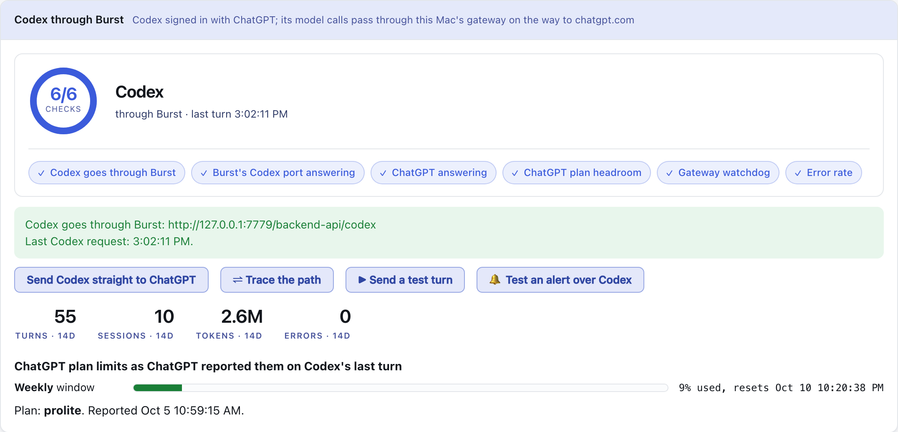
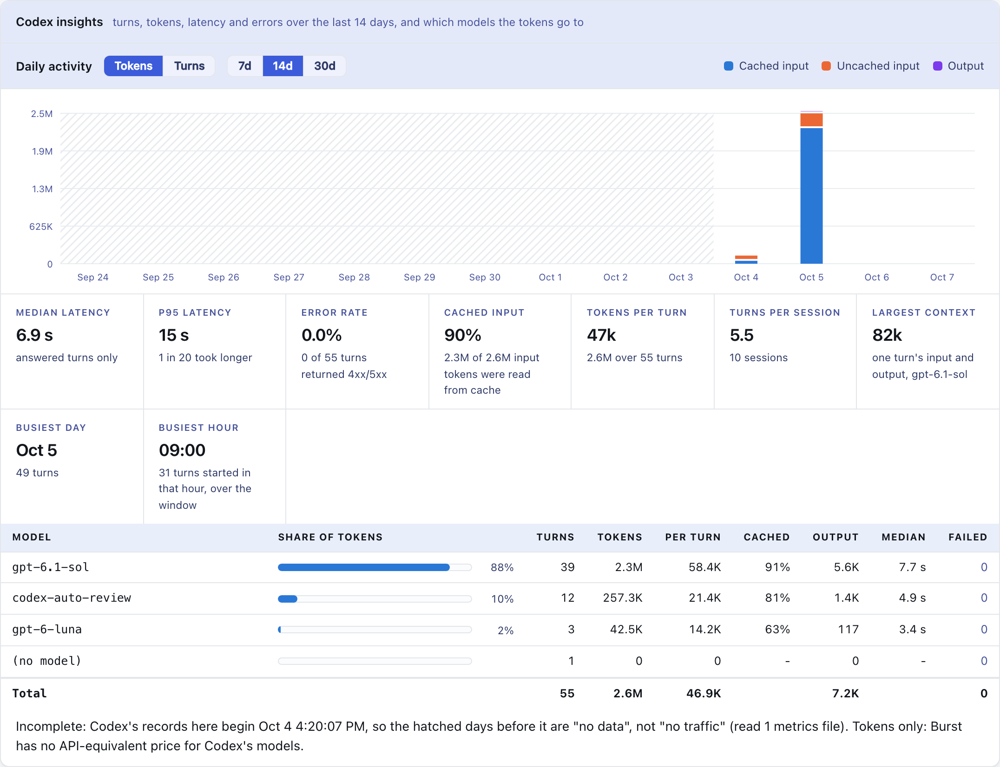
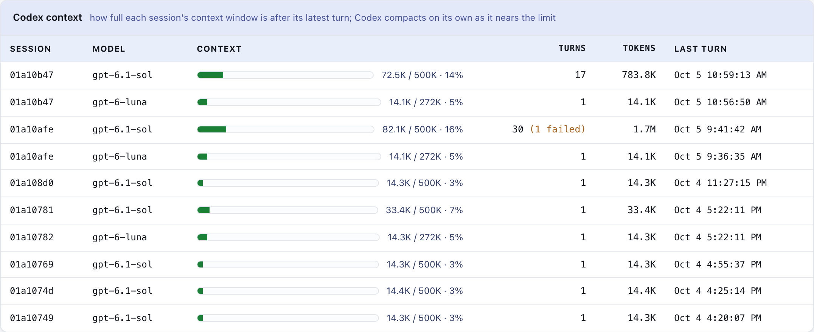
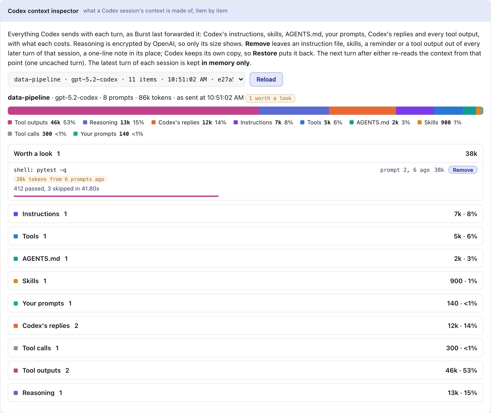

# Codex through Burst

[Back to the README](../README.md)

Claude Burst also carries OpenAI's **Codex** (the ChatGPT app's Codex and the `codex` CLI), signed in with ChatGPT. Its model calls pass through a second gateway on this Mac on their way to `chatgpt.com`, so the dashboard's **Codex** tab can show what they cost in tokens, how full each session's context is, and how much of the ChatGPT plan's limits is used.

## Turn it on

Dashboard, **Codex** tab, **Route Codex through Burst**. Or:

```bash
claude-burst codex enable    # route Codex through Burst
claude-burst codex status
claude-burst codex disable   # straight to ChatGPT again
```

Then **restart Codex**: quit and reopen the ChatGPT app, and restart any `codex` running in a terminal. Codex reads its config when a session starts.

## How it works

- `enable` adds a model provider at the **top** of `~/.codex/config.toml` (or `$CODEX_HOME/config.toml`), between `# BEGIN claude-burst` and `# END claude-burst`, after saving a copy of the file to `~/.config/claude-burst/backups/`. Nothing outside the markers is touched.
- The provider points Codex at `http://127.0.0.1:7779/backend-api/codex` with `requires_openai_auth = true`, so Codex keeps its ChatGPT sign-in and sends its own token with every request.
- The gateway forwards each request to `chatgpt.com` **unchanged** and reads the reply on its way back: the turn's tokens (from `response.completed`), each model's context window (from the model list), and the plan usage ChatGPT reports in its `x-codex-*` headers.
- Only model calls (`/models`, `/responses`) go through Burst. Codex's sign-in, plugins and cloud tasks go to ChatGPT directly.
- Each turn is recorded, metadata only, in `~/.config/claude-burst/codex-metrics.jsonl`, apart from Claude Code's `metrics.jsonl`: no Claude Code total ever includes a Codex turn. The gateway log gets one `codex: turn ...` line per turn.
- **Everything that is HTTP is passed on**, whatever its method or path: a request, a streamed reply, a WebSocket, and HTTP/2 without TLS. A reply ChatGPT refuses (a 401 on the model list, say) goes back to Codex as it came and is logged as `codex: GET ... answered 401 by ChatGPT`.
- **What cannot be passed on is logged as an error.** A connection that is not HTTP at all (a TLS handshake sent to the plain port, another protocol, a request line that does not parse) has no request to forward, and ChatGPT would refuse the same bytes. Burst answers `400` itself, writes `level=error codex: refused a connection on the Codex port ...` with what the connection began with (the first line only, never headers or a query), and the Codex tab's check **Nothing turned away at the port** goes red for an hour. Search the log for `codex: refused`.
- **Both kinds of failure are rows in the Codex requests table** beside the turns: a refused connection (slot `refused`, in red), and a request that is not a model call but that ChatGPT refused, with the Codex client that sent it. The latest 50 are kept, across restarts, apart from the turns: no count, error rate or check includes them.
- The listener runs whenever Burst runs, routed or not: a Codex session keeps sending to the port it started with until it exits.
- If `config.toml` already sets its own `model_provider`, Burst refuses rather than override it, and says which.

Checked against codex-cli 0.159.2. The other route, `chatgpt_base_url`, was rejected: Codex requires it to be HTTPS and it also carries plugin, MCP and account calls.

## The Codex tab









| Section | What it answers |
| --- | --- |
| Checks and overview | Is Codex going through Burst, is ChatGPT answering, and how much of the plan is used? |
| Insights | Turns, tokens, latency and errors per day, and which models the tokens go to |
| Context | How full each session's window is |
| Context inspector | What a session's context is made of, with Remove and Restore |
| Requests | The recent model calls, one a row |

- **Checks**: Codex's own meter, as the Claude tab's is Claude Code's, with the same rule (the worst failing check sets the colour) and a fix button on each failing check:
  - **Codex goes through Burst**: Burst's block is in `~/.codex/config.toml` (red if that file does not parse; amber if Codex goes straight to ChatGPT).
  - **Burst's Codex port answering**: red when Codex is routed to a port nothing answers on.
  - **ChatGPT answering**: the newest turn ChatGPT answered, while under 10 minutes old; red on a 5xx, no answer, a refused sign-in (401/403) or the plan's limit (429). A 499 is Codex hanging up and does not count.
  - **ChatGPT plan headroom**: amber at 90% of any plan window.
  - **Gateway watchdog**: one gateway serves Codex and Claude Code.
  - **Error rate**: amber at 2% of Codex turns over 14 days.
- **Overview**: whether Codex goes through Burst, the gateway's listener (with the reason if it is not listening), the last request, 14-day turns, sessions, tokens and errors, and the **ChatGPT plan limits** as bars (for example the weekly window, percent used, when it resets).
- **Insights**: what the Claude tab's Daily activity and Analytics are for Claude Code, over 7, 14 or 30 days.
  - **Daily activity**: a bar per day, as **Tokens** (cached input, uncached input and output, stacked) or **Turns** (answered and failed). Days older than the log are hatched as "no data", never drawn as empty.
  - **Tiles**: median and p95 latency (answered turns only), error rate (amber at 2%, red at 5%), the share of input read from cache (amber under half: Codex is sending most of each conversation uncached, which uses the plan fastest), tokens per turn, turns per session, the largest context any turn reached, the busiest day and the busiest hour of the day.
  - **By model**: each model's share of the tokens, with its turns, tokens per turn, cached share, output, median latency and failed turns.
  - Tokens only: there is no API-equivalent price for Codex's models. The same figures as JSON: `curl -s 'http://127.0.0.1:7788/api/codex/insights?days=14'`.
- **Context**: each recent session's context after its latest turn against its model's window, as a bar: green, amber from 60%, red from 85%. Codex compacts on its own as it nears the limit.
- **Context inspector**: with the same bar of the context by part as [Claude Code's](dashboard.md#context-inspector). A Codex session's context item by item, as Burst last forwarded it: Codex's instructions, skills, the developer reminders, AGENTS.md, your prompts, Codex's replies and tool calls, every tool output, and the encrypted reasoning (size only). **Remove** leaves AGENTS.md, skills, a reminder or a tool output out of every later turn of that session, a one-line note in its place; **Restore** puts it back. See [the dashboard](dashboard.md) for how removal works.
- **Requests**: the recent model calls, with uncached input, cached input and output apart.

When ChatGPT refuses a turn for the plan's usage limit, an on-screen alert says so with the reset time, and clears on the next accepted turn.

## Undo and recovery

Every way out removes Burst's block, through the same `scripts/codex-unroute.sh`:

- **Send Codex straight to ChatGPT** on the Codex tab, or `claude-burst codex disable`.
- `burst-off` and `scripts/rollback.sh` (everything off).
- `./install.sh uninstall`.
- [Repair](../README.md#repair-burst) checks the Codex port answers when Codex is routed here, and offers to unroute it if not.

By hand: delete the lines from `# BEGIN claude-burst` to `# END claude-burst` in `~/.codex/config.toml`. Restart Codex afterwards.

[Diagnose](../README.md#diagnose-burst) reports Codex's routing, the block, the port, a forwarding probe, Codex's processes and its recent turns.

## Not yet

- No failover for Codex: when the ChatGPT plan is out, Codex stops as it would without Burst (the alert says when it resets). A secondary needs Responses API translation.
- No API-equivalent price for Codex models yet: tokens only.
- Compaction, coordination, automask and the band are Claude Code features and do not apply to Codex.
