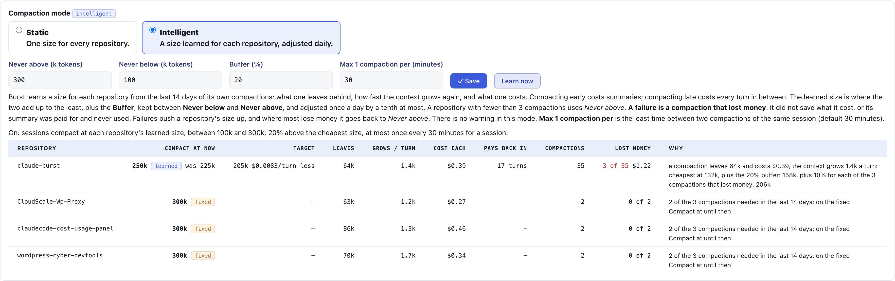
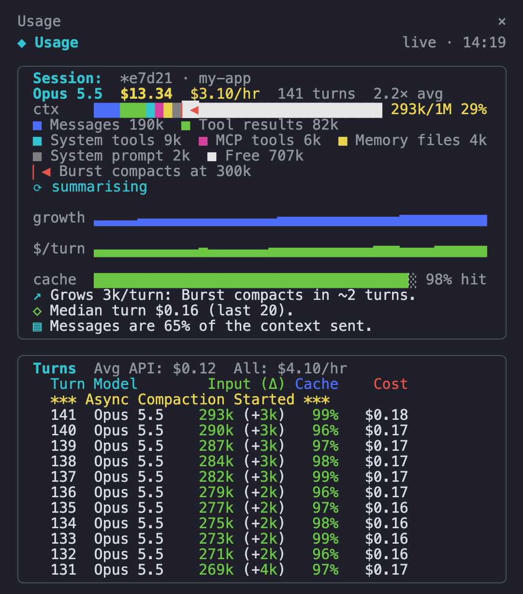
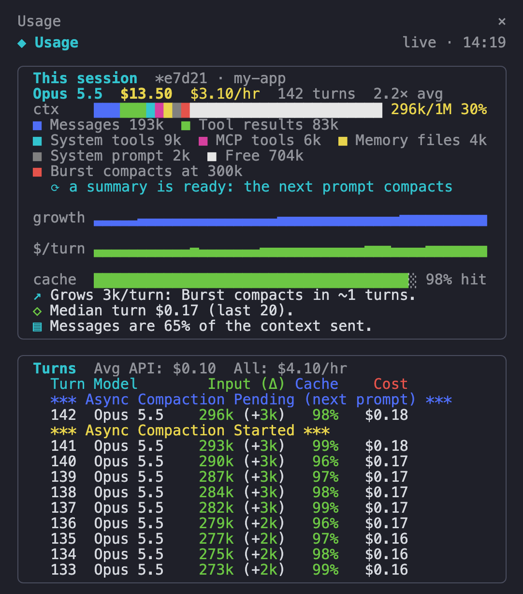
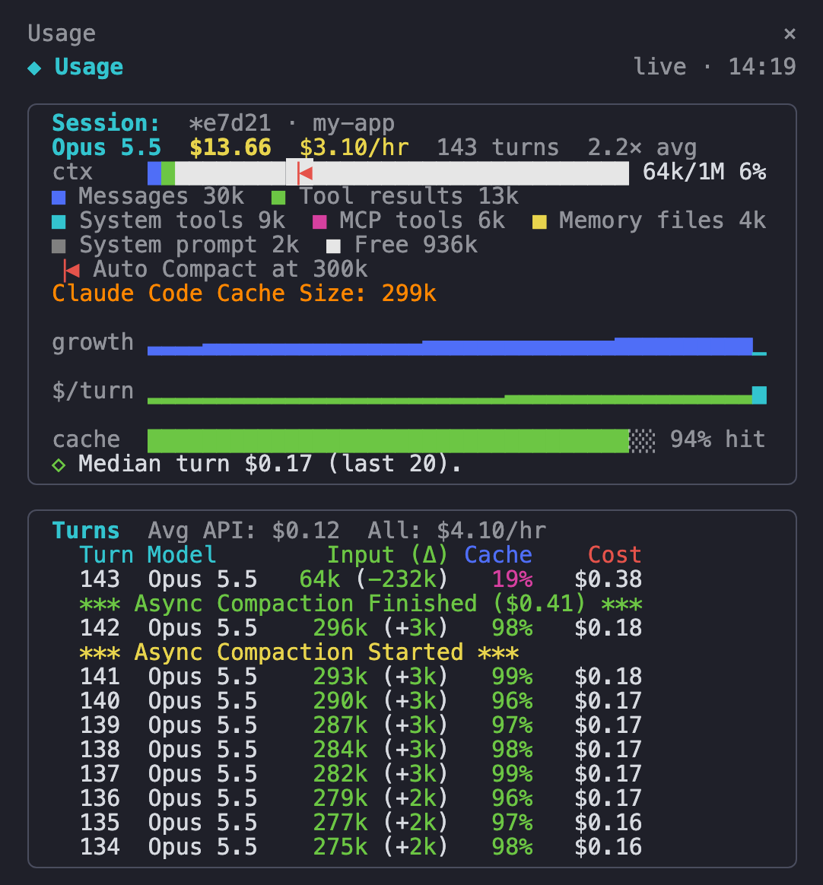

# Pauseless compaction

[Back to the README](../README.md)

**Claude Code's `/compact` stops the session while it summarises. Burst's compaction never does.**

**And it learns when.** [Intelligent Compaction Mode](#intelligent-compaction-mode-a-limit-learned-for-each-repository) finds the cheapest size to compact at for each repository, from that repository's own compactions, and adjusts it daily.

**What is pauseless compaction?** Claude Code has no pauseless compaction mode of its own: its `/compact`, and the auto-compact near the end of its context window, stop the session while the conversation is summarised. Pauseless compaction is Claude Burst's alternative. A local gateway between Claude Code and Anthropic writes the summary in a background request while you keep working, then swaps it in on your next prompt. Claude Code is unchanged, your place in the conversation is kept, and there is nothing to type: it fires by itself, or on demand with [`/compact-async`](#compact-now-compact-async). Turn it on in the dashboard under **Pauseless Compaction**.

**You see it in Claude Code itself.** A line appears under the prompt you send, for example `⚡ Burst compaction: done, 88% smaller: 666k → 78k (1074 messages summarised)`. There are lines for when a summary starts, when it is ready, when it has cut the context, and when it fails or no longer fits. They come from a hook the dashboard installs (on by default, with a switch): under each prompt (`UserPromptSubmit`), and after each tool call inside a long turn (`PostToolUse`). A summary that is ready mid-turn waits for your next prompt, and the hook says so once, so a long turn never looks like compaction has not fired. Claude does not see these lines, so they cost no context.


On the subscription every turn re-reads the whole conversation, so a turn at 400k tokens costs about four times one at 100k and uses up your limits four times as fast. Claude Code only compacts near the end of its 1M window. With pauseless compaction on:

- When a session's context passes **Compact at** (default 300k), Burst sends one background request, on your subscription with the session's own login, asking the same model to summarise everything sent so far, the running turn included. It takes about 40 seconds and you keep working.
- The summary request resends the history exactly as Claude Code last sent it, so it reads from cache rather than paying for the whole context again.
- From your next prompt, Burst sends the summary in place of those messages, and keeps only what came after the request the summary was written from. Your latest prompt is carried word for word beside the summary. Claude Code keeps its full local history and sees no difference. CLAUDE.md and other session context are carried over word for word. Thinking from before the summary is dropped, as Anthropic requires when history changes.
- `/clear`, `/compact` or a rewind make the summary stop fitting, and requests then go through untouched.
- A session is compacted at most once per window (default 30 minutes), a warning is logged at **Warn when at** (default 80% of **Compact at**; none in Intelligent mode), and state survives a gateway restart. A summary that fails is retried after 5 minutes, and a summary that stops fitting reopens the window at once, so a session is never left on its full history for the rest of the window.
- **Limit:** Claude Code never learns that Burst shortened the history, so its own copy keeps growing. If Burst's summary stops fitting after that copy has passed the 1M window, the full history is too big to send: Anthropic refuses it and Claude Code compacts in its own way, with the pause. The gateway log says which message changed, so the cause can be found.

**What it did in its first day** (one long Opus 5.5 session, 2026-09-29 to 30): three summaries, the biggest drop 611k tokens to 49k with recall intact. The first two summaries cost $2.10 and $2.96 API-equivalent because they did not read the session from cache; the fix brought the third down to **$0.21**. What that is worth over a day is in [Savings per day](#savings-per-day-and-what-it-means-on-a-subscription) below.

**Where the summary is kept.** A summary is part of your conversation, so it is stored like one: in `~/.config/claude-burst/compaction-state.json`, written with mode 0600 (readable by you only), and removed once its session has gone 48 hours without a request. That is the one place Burst writes conversation content to disk; the logs never hold any (see [What is logged](logging.md)).

## Compact now: `/compact-async`

**`/compact-async` is `/compact` without the pause.** Type it in Claude Code whenever you want the context cut, instead of waiting for **Compact at**.

| | `/compact` (Claude Code) | `/compact-async` (Burst) |
|---|---|---|
| While the summary is written | session stops, you wait | you keep working |
| When it takes effect | when it finishes | at your next prompt after it is ready (about 40s) |
| Context size needed | any | any; ignores **Compact at** and the 60 minute window |
| What Claude Code keeps | the summary only | its full local history; only what is sent is shortened |

What happens:

1. You type `/compact-async`. Burst sees the command's marker in the prompt and starts the background summary of everything before it.
2. Claude replies with one line, `Pauseless compaction started: it swaps in with your next prompt, keep working.`, and uses no tools.
3. Keep working. Under your next prompt, the Burst line says what happened, for example `/compact-async: summarising 812 messages (214k) in the background`.
4. The first prompt after the summary is ready carries it, and its line reports the drop, for example `Context down 80%, 214k → 43k`.

Good to know:

- **Installed for you.** The dashboard writes `~/.claude/commands/compact-async.md` while Pauseless Compaction is on and deletes it when it is off. It shows in Claude Code's `/` menu beside `/compact`. A `compact-async.md` of your own is never overwritten or removed.
- **One at a time.** Asking again while a summary is being written, or is ready and waiting, starts nothing new; the prompt line says which.
- **Needs something to summarise.** At the very start of a session there is too little before the prompt, and the prompt line says so instead.
- **Only your prompt triggers it.** The marker inside a file Claude reads, or any other tool output, is ignored.
- **Cost:** one summary request on your subscription, read from cache, typically about $0.20 API-equivalent (see [the savings](#how-the-savings-are-calculated)).

## Two copies of the conversation: what Claude Code keeps and what Burst sends

This is the difference that matters most between Burst's compaction and every other kind.

**Context windows, briefly.** A model has no memory between requests. Every request carries the whole conversation: system prompt, tools, CLAUDE.md, every prompt, every reply and every tool result so far. The context window is the most a request may hold (1M tokens on Opus 5.5 and Fable). Three things follow:

- **Cost grows with the conversation, not with the question.** A one-line prompt at 400k of context re-reads 400k tokens. From cache that is a tenth of the input price, but it is paid on every request, and one turn is often 10 to 30 requests (one per tool call).
- **The cache is keyed on the start of the request.** Change anything early and everything after it is written to the cache again at 1.25 times the input price. So a compaction is never free: what it leaves behind is written once more.
- **Quality drops before the window is full.** A model attends less reliably to detail in the middle of a very long context, so a session at 800k is dearer and less sharp than one at 150k.

Compaction replaces the old part of the conversation with a summary. There are two places it can be done, and they differ in what is lost.

| | Claude Code `/compact`, or a mod that answers it | Burst (gateway) |
|---|---|---|
| Where the history is shortened | inside Claude Code: the old messages are replaced | on the wire only: the request is rewritten as it leaves the Mac |
| Claude Code's own transcript | summary plus a short tail | everything, word for word |
| A poor summary | permanent, the detail is gone | can be dropped: the next request carries the full history again |
| Burst out of the path | no effect | the full history is sent, uncached |

**What it means, exactly.** Claude Code builds every request from its whole transcript. Burst receives that request, checks that it still starts with the messages its summary was written from, and replaces those messages with the summary before sending it on. Anthropic's model only ever reads the short version. Claude Code never learns that anything changed.

**Why the gateway is the better place.**

- **Nothing is destroyed.** The summary is a view over the transcript, not a replacement for it. A summary that turns out poor is dropped and the original comes back. Compaction inside Claude Code cannot be undone.
- **No pause.** The summary is written by a background request while you work, and swapped in between two requests. Claude Code's own compaction stops the session for 7 to 77 seconds in one set of measurements.
- **The summary call is nearly free.** It resends the request Claude Code just sent, so it reads the history from the cache entry that request wrote: about $0.20 at 400k, against about $2 for a summary that misses the cache.
- **It can compact in the middle of a turn.** A gateway sees every request, so a turn of 200 tool calls is cut while it runs. Claude Code compacts only when its window is nearly full.
- **It can choose when.** The limit is yours, per repository, and Intelligent mode learns it from what compactions cost and saved. Claude Code's limit is fixed near the end of its window.
- **Rewind, resume and the transcript still work on the real history.** Rewinding to a message from before the compaction gives you that message, not a summary of it.
- **Nothing runs inside Claude Code.** No plugin to install and nothing to keep in step with Claude Code releases.

**What it costs.** Claude Code's own copy keeps growing, so a request that leaves the Mac without Burst carries all of it (example 4), and Claude Code's own limit still exists (example 5). Burst shows what Claude Code holds, and alerts the moment it is bypassed.

**Example 1, a normal turn** (a real session, 5 Oct 2026):

```
Claude Code builds the request:   664 messages, about 980k tokens
Burst replaces messages 0-601:    1 summary (13k characters) + 62 newer messages
Anthropic receives and bills:     139k tokens
Claude Code's transcript after:   still 664 messages, plus the reply
```

**Example 2, the summary missed something.** You ask about a detail from three hours ago and the summary does not have it. The detail is still in Claude Code's transcript. **Drop summary**, beside the session in the dashboard's compaction table, sends the full history on the next request, and the model can read it again. The price is one uncached read of the full history, and no new summary starts for one delay. After `/compact` in Claude Code, or a mod that answers it, the detail is out of the session for good; it is still in the transcript file on disk, for you to read, not for the model.

**Example 3, you rewind.** Rewinding to a message that was summarised changes the start of the request. The summary no longer fits, Burst drops it, and the request goes as Claude Code sent it, in full. Nothing is lost, and a new summary starts at once.

**Example 4, Burst is not in the path.** The gateway is down, or `burst-off` was run. Claude Code sends what it holds: on 2026-10-04 a session Burst kept at 135k sent 994k for $7.75 in one turn. This is the cost of keeping everything, and why the band shows what Claude Code holds.

**Example 5, Claude Code's own limit still exists.** Claude Code's copy keeps growing. Past the model's 1M window Claude Code compacts in its own way, with the pause, and its transcript really is shortened. Burst's summary then stops fitting and is dropped.

**What Burst keeps after a compaction.** The summary, CLAUDE.md and the other session context word for word, your latest prompt word for word, and every message after the request the summary was written from. Up to and including v0.17.0 it kept the whole running turn instead, so a long turn left 140k and more behind (the 139k in example 1).

## Claude Code's own history, and what a bypass costs

Burst compacts what it **sends**. Claude Code's own copy of the conversation is never
shortened, and Claude Code only learns its size from Burst's replies, so its own
auto-compaction never fires while Burst is in the path. Whenever Burst drops out
(the gateway down, the redirect removed by the pf guard, `burst-off`), the next turn
sends all of it, uncached: on 2026-10-04 a session Burst kept at 135k sent 994k for $7.75.

- The band shows `CC holds 994k` beside the context, amber from 500k, red from 800k.
  The dashboard's compaction table has the same figure under **Claude Code holds**,
  with its uncached price on hover.
- From 500k, and again every further 200k, the session gets a line and an alert:
  what a bypass would cost, and to run `/compact` now. Through Burst that costs little
  (the summary is in force) and shrinks Claude Code's own copy.
- Burst out of the path is an error alert, **Burst bypassed**, as soon as it happens
  and on the first look after the gateway starts, since the gateway is usually what
  was down. A bypass chosen with `burst-off`, `rollback.sh` or `disable` is quiet.

### Hand-off: Claude Code takes Burst's summary

With the `burst-session` mod installed (Sessions menu, **In-session band**), the summary Burst
already wrote can become Claude Code's own compaction, so a bypass stops costing the
whole history:

- For every session with a summary in force the gateway keeps
  `~/.config/claude-burst/handoff/<session>.json` (mode 0600): the summary as Burst sends
  it, and the two messages either side of the cut, each named by a tool call id or by
  the start of its text. The file goes when the summary is dropped.
- **Any compaction by Claude Code is answered with it**: `/compact`, or Claude Code's own
  automatic one. The mod finds the cut in Claude Code's transcript and hands back the
  summary followed by the kept messages, untouched. No summary request is made and
  nothing pauses. `/compact` with instructions of your own, a subagent's transcript, and
  a transcript the cut cannot be found in are left to Claude Code.
- **A session that has left Burst is compacted once, by itself.** The mod checks every 5
  seconds whether its requests still go through Burst (`ANTHROPIC_BASE_URL` naming the
  gateway, in the environment or in `~/.claude/settings.json`, or the `api.anthropic.com` line in `/etc/hosts`). When neither is there, a
  hand-off exists and Claude Code holds 300k or more, it runs `/compact`, which the
  hand-off then answers. A gateway that is restarting or down but still in the path is
  not a bypass: requests fail then, they are not sent whole, and nothing is compacted.
  If the summary does not fit, nothing is compacted and a line says so.
- **A session opened again is compacted as it opens.** `claude --resume`, `--continue`
  or a Finder shortcut on a session Burst had summarised, holding 300k or more: the mod
  runs the same `/compact` within 5 seconds of opening, with Burst in the path or not.
  It is done on opening and not on closing because a closing session is a process on
  its way out, and a shut window or a crash never closes at all. A reload of the mod
  (`/reload-plugins`) is not a restart, and a summary written after the session opened
  waits for the next one.
- **`/compact-async-full` does it on request.** Typed in any session Burst has
  summarised, in the path or not, at any size, it compacts with Burst's summary. It is
  never Claude Code's own compaction: with no summary held, or one that does not fit,
  nothing is compacted and a line says so. The automatic hand-offs are this command.
- **Near the 1M window it is compacted with Burst still in the path** (on by
  default). Past 1M a bypass is refused as too long, not just expensive. With **Also from
  800k held, with Burst still in the path** ticked on the dashboard (`handoff_in_path` in
  `~/.config/claude-burst/mod.json`), the mod runs the same `/compact` from 800k held
  while Burst is working normally. It can be turned off because it has costs: the turn
  after it is read uncached, and the model no longer has the replaced messages, only the
  summary.
  Turned off, `/compact-async-full` does it for one session when you choose.
- After a hand-off the replaced messages are out of the session Claude Code sends too,
  so **Drop summary** can no longer bring them back, and with Burst still in the path the
  session is a new, short conversation to it: its old summary is retired and the window
  starts again.
- **Nothing is deleted.** Claude Code's transcript file for the session,
  `~/.claude/projects/<folder>/<session>.jsonl`, is only ever added to: a compaction
  writes a boundary line and the summary after the messages it replaced, and they stay
  in the file before it. A session compacted by Claude Code at 967k on 12 September
  still has its 1,815 earlier messages there. The model cannot see them and no command
  loads them back; they are a record to read or search. Burst itself keeps only
  summaries, not the messages.
- Turn it off under **When Burst is out of the path** in the same section (on by
  default, `handoff` in `~/.config/claude-burst/mod.json`, which the mod reads itself
  because the gateway may not be there to ask).

Tried live on 2026-10-05 with Claude Code 2.1.289: a typed `/compact` and the automatic
one both replaced the transcript with the handed summary, the session answered from it,
and no summary request was made.

## Intelligent Compaction Mode: a limit learned for each repository

**Burst works out when to compact each repository, from that repository's own history, and shows its reasoning.** Compacting early costs summaries; compacting late costs every turn in between. Where the two add up to the least is different for every repository, and it moves as the work changes.



In the screenshot `claude-burst` has 35 compactions in its 14 days: one leaves 64k and costs $0.39, and the context grows 1.4k a turn, so the cheapest size is 132k. The 20% buffer makes that 158k, and three compactions that lost money add 10% each: a target of 206k, against the fixed 300k. The size in force is 250k: it moves towards the target by a tenth a day at most, and a compaction that loses money lifts it by a tenth at once (it was 225k the day before). The other three repositories have had 2 of the 3 compactions needed, so they stay on the fixed size and say so.

One *Compact at* does not suit every repository. With **Mode** set to **Intelligent Compaction Mode** (dashboard, Pauseless Compaction), Burst learns a *Compact at* for each repository from the last 14 days of that repository's own compactions:

- **What it weighs.** Compacting early costs summaries (each one reads the whole history, then the shortened history is written to cache). Compacting late costs every turn in between, since each turn reads the whole context. With a compaction leaving `A` tokens, the context growing `g` a turn and a compaction costing `c` beyond reading the history, the cheapest size is `A + sqrt(2 * g * (A + c))`, with `c` counted in cache-read tokens.
- **Once a day.** The first learned size is used as it is; after that it moves by a tenth a day at most. **Learn now** recalculates the figures without moving it a second time that day.
- **Never lose money twice.** Each compaction that lost money adds 10% to that repository's limit, at once, without waiting for the daily step, up to the fixed **Compact at**. It comes back down, a tenth a day, as the loss ages out of the 14 days.
- **Failures are compactions that lost money.** One that had not saved what it cost by the time its session moved on, a summary call that was paid for and wrote nothing, or a summary dropped before it was used. They are counted for each repository and shown in the table. They push the learned size up, and where more than half of at least four lost money the repository goes back to *Compact at*. So does one whose sessions end before a compaction has paid for itself twice over.
- **Guards.** A **Buffer** (20% unless you change it) is added on top of the cheapest size, so the limit is less eager than the money alone says. Never below the **Floor** (100k unless you change it), never above *Compact at*, nothing learned from fewer than 3 compactions, and *Delay between compactions* still applies (default: a session is compacted at most once every 30 minutes). A repository override always wins. The log measures money, not what a summary loses, which is why the floor exists.

The table lists each repository with the limit in force, the target, what a compaction leaves, growth per turn, cost, payback and the compactions that lost money, with the reason in words. With the mode off the table still shows what it would use.

**For other tools:** `GET http://127.0.0.1:7788/api/GetAutoCompactionThreshold?folder=<name or full path>` (or `?session=<id>`) answers with the limit in force for that folder: `threshold` (tokens, 0 when never), `source` (`learned`, `override`, `fixed` or `off`), `fixed`, `floor`, `target`, `delay_minutes`, `failures` and `reason`. The cost sidebar asks it for the folder a session runs in.

## A different limit for some repositories

*Compact at* is the default for every session. Under **Repository overrides** in the dashboard, a repository can have its own size (a big monorepo that needs more context, say 500k) or **Never compact**, which leaves its sessions alone unless you run `/compact-async`. *Warn when at* and the delay between compactions apply to the repository's own size.

A session's repository is the folder holding `.git` above where Claude Code was started, read from its transcript. The match is on the full path, so two checkouts of the same project can differ. A session whose repository cannot be worked out yet uses *Compact at*. The sessions table shows each session's repository and the limit that applies to it.

## How the savings are calculated

A compacted request does not record what it would have sent without Burst, so the dashboard works it out by replaying each session from `metrics.jsonl`, request by request, beside a **"without Burst" twin**:

- **The twin grows as the session grows.** On every request the twin's context changes by exactly as much as the real one, except that it never takes Burst's drops.
- **Claude Code compacts the twin.** Without Burst the session would not grow past the 1M window: Claude Code compacts on its own near the end of it. When the twin reaches **950k** (95% of the window; Claude Code does not publish its exact threshold), it is compacted back down to the size of one of Burst's summaries. So fifteen compactions never claim fifteen windows of saving, and just after the twin has been compacted it can be smaller than the real session; those requests count **against** Burst.
- **Saving per request** = twin context minus real context, priced at the model's cache-read rate (in a long session every resent token is a cache read).
- **Net saving** = the sum of those, less every summary call, less the extra cost of writing each shortened history to cache on the request after a swap (where the twin would only have read). The twin's own compactions by Claude Code are not credited back, so the net figure errs low.
- All figures are API-equivalent: on a subscription the real effect is using your limits more slowly, not a smaller bill.

The dashboard shows the net figure in the Pauseless Compaction section (per session, with the parts on hover), in the **Saved, net** tile under Analytics, and per day in the Saved chart's tooltip. The same explanation is on the page under *How the savings are calculated*.


The Saved view above is also an illustration, not a measured month: the real daily average so far (2026-09-29 to 10-01, about 195M tokens of context compacted per active day) spread over 30 days, weekdays varying by a fixed pattern and weekends at 35%.

### The other saving: overflow to the secondary

Past the plan's limit Burst sends requests to the secondary. `overflow_stats` in
`/api/state` (under `context`, the same 7 days) prices each of those requests twice: the
same tokens at the price of the model Claude Code asked for, which is what they would
have cost on Anthropic's API, and what the secondary charged. The difference is the
saving, per day and in total, and it is negative on a day the secondary was the dearer
one. Only answered requests with both prices known are counted (`priced` against
`requests`), so a model with no price leaves the figure short rather than invented. The
usage panel's sidebar draws it as **Overflow to Secondary**, under Pauseless Compaction.

## Savings per day, and what it means on a subscription

The Pauseless Compaction section charts each day: **savings** (context compacted, priced at what resending it would have cost) above the line, **cost** (the summaries and the cache rewrites after each swap) below it, on one scale. The header totals the net for the window, hovering a day shows the breakdown, and *Show as a table* lists every day.


**The chart above is an illustration, not a measured month.** It is the first two real days of Pauseless Compaction (2026-09-29 and 30, one person, long Opus 5.5 sessions in Claude Code) repeated over 30 days, each weekday varied by a fixed pattern around the real daily average and weekends at 35%. The measured figures are these:

| Measured, per active day (2 days, one user) | API-equivalent |
|---|---:|
| Savings: context compacted | $30.19 |
| Cost: summaries | -$3.42 |
| Cost: cache rewrites | -$0.87 |
| **Net** | **$25.90** |
| Compactions | 6 |

What that figure is, and is not:

- **It is API-equivalent value**: what the context Burst did not resend would have cost at public API prices. It is not money you get back.
- **On a Pro, Max or Enterprise subscription your bill does not change.** The effect is that your usage limits last longer, because each turn re-reads a shorter context.
- On a metered API key primary the saving is real money, at roughly the same rate.
- Cost comes to about 14% of the savings, so roughly 86 cents in every dollar of context compacted is kept.
- Your figure depends on how long your sessions run. A session that never passes **Compact at** (default 300k) is never compacted and saves nothing; the savings come from long sessions, and grow with them.
- Two days is a small sample. The dashboard shows your own numbers over the last 7 days as soon as a session has been compacted.

**Where to see it:**

- **Dashboard, Pauseless Compaction** (its own entry in the menu): the on/off switch and thresholds, headline figures for the last 7 days, and a table of sessions with context **before** and **after** the latest summary, the **saving per turn**, and the **net saving** after summaries and cache rewrites.
- **Dashboard, Daily activity, Saved:** the tokens compaction removed (context compacted), stacked with what overflow pruning removed, per day. The tooltip shows what each saved and what the summaries cost.
- **[Usage panel](https://github.com/andrewbakercloudscale/claude-code-cost-sidebar)** (the companion sidebar): Started, Pending and Finished rows in the turn table, a green negative context delta on the turn where the summary landed, and the summary's cost in the session total. Its ctx bar is the context Burst sends, by part, against the limit set here. One compaction, as the sidebar shows it (figures made up):

<table>
<tr>
<td valign="top"></td>
<td valign="top"></td>
<td valign="top"></td>
</tr>
<tr>
<td align="center"><sub>1. Started: summarising in the background</sub></td>
<td align="center"><sub>2. Pending: waiting for the next prompt</sub></td>
<td align="center"><sub>3. Finished: the context dropped, no pause</sub></td>
</tr>
</table>
