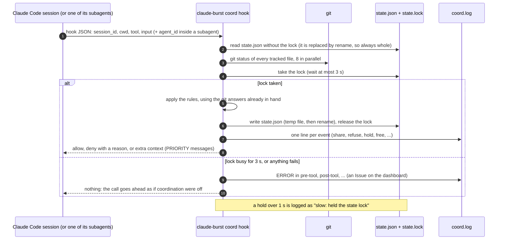
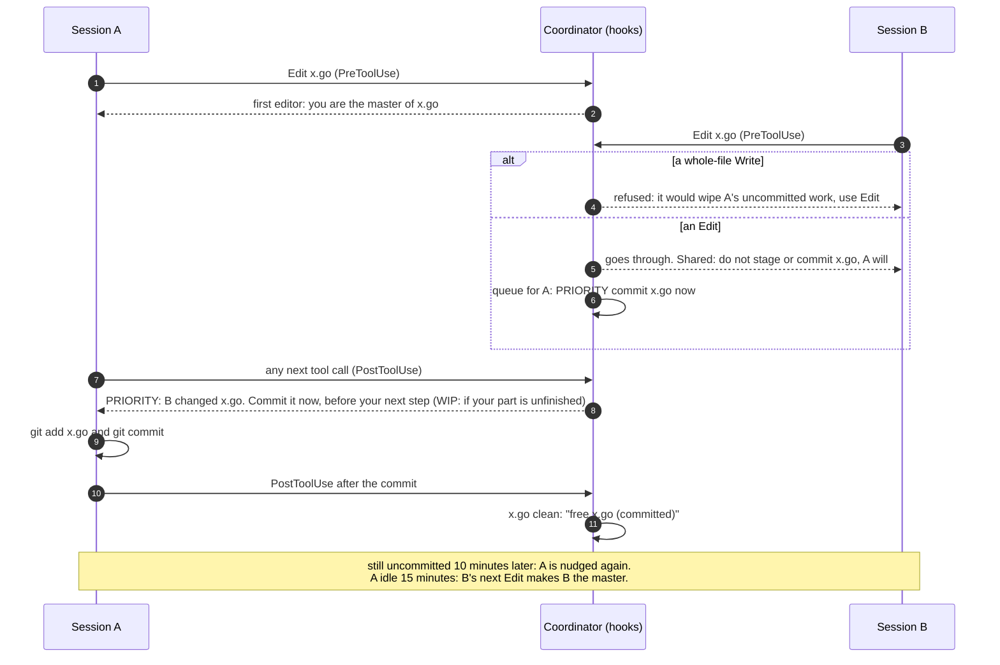
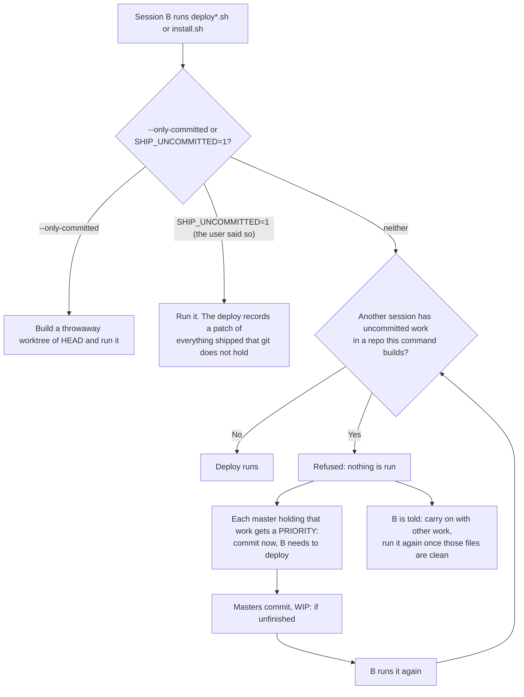
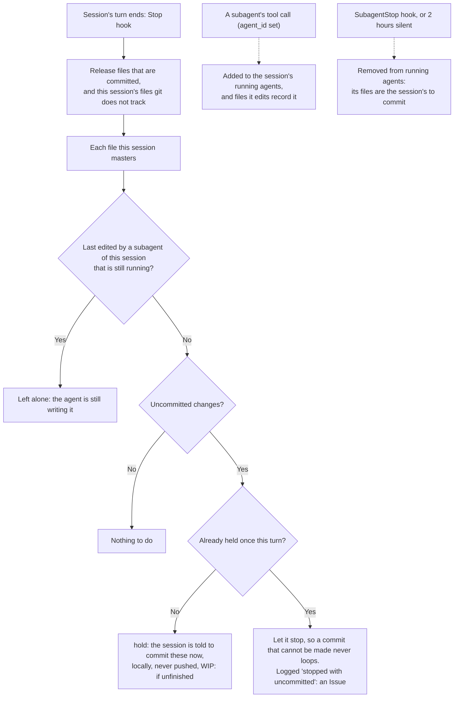
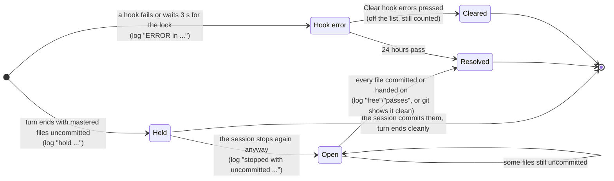

# Session coordination: several sessions, one working tree

[Back to the README](../README.md)

**Several Claude Code sessions can edit the same files without losing or sweeping up each other's work, and nobody waits.** Off by default; switch it on in the dashboard under **Session coordination** (Leading Edge).

Two sessions in one repository go wrong in a few ways: one rewrites a file over the other's uncommitted change, one commits with `git add -A` and ships the other's half-done work, or one stashes or resets under the other. Coordination prevents those with Claude Code hooks (seven: SessionStart, PreToolUse, PostToolUse, UserPromptSubmit, Stop, SubagentStop, SessionEnd), so every session on the Mac takes part without being asked.

The design rule is that **nobody waits on anybody**. There are no locks: edits always go through. Instead, commits are accelerated: a session holding uncommitted work that another session needs is told to commit it now, ahead of its own work, as "WIP:" if its part is unfinished. A small early commit is cheap; a session sitting idle behind a lock is not.

- **The first session to edit a file is its master, and commits it.** That is the only session that commits it.
- **Another session can still edit it, with no wait.** Claude Code's Edit replaces an exact piece of text and refuses when the file changed since it was read, so two sessions' edits cannot overwrite each other. The change goes through; the master is told what changed and asked to commit the file at its very next tool call, ahead of its own work (as "WIP:" if its part is unfinished), so nobody's change waits behind another session's; the other session is told the file is shared and not to commit it.
- **What is refused:** a whole-file Write over a master's uncommitted work (use Edit instead); a git add or commit by another session that names a file someone else masters; `git add -A`, `git add .`, `git add -u` or `git commit -a` while another session has uncommitted work in the same repository; and, for the same reason, running a deploy or install script there (`deploy*.sh`, `install.sh`), which builds the working tree and would ship that work in no commit. A refused call is not run, and the session is told why and what to do instead. For a deploy, the sessions holding the uncommitted work are asked to commit it at once, and the deploying session is told to carry on with other work and run it again once they have, or to use `scripts/deploy.sh --only-committed`, or, only on your say-so, prefix `SHIP_UNCOMMITTED=1`.
- **Every deploy says what it ships that git does not hold.** `scripts/deploy.sh` and `install.sh` build the working tree, so they list any uncommitted files they are about to ship and keep a copy (patch plus untracked files) in `~/.config/claude-burst/shipped-uncommitted/`, whether coordination is on or not. `scripts/deploy.sh --only-committed` ships exactly HEAD instead.
- **A session commits before it stops.** A turn that would end with files its session masters uncommitted is held once, with the instruction to commit them now: locally only, never pushed, and with "WIP:" in the message if the work is unfinished. A second stop in the same turn is let go, so a commit that cannot be made never keeps a session going round. This is what makes handing a file on safe: whoever takes it next finds it committed.
- **Subagents are not mistaken for their session.** A subagent (the Agent tool, often in the background and in its own worktree) runs its hooks with its parent session's id, so its edits used to read as the session's own, and the session was held at the end of its turn to commit files the agent was still writing. Hook calls from inside a subagent also carry an `agent_id`: coordination now records which subagent last edited each file, keeps each session's running subagents (added at their first tool call, removed by the SubagentStop hook, and counted as finished after 2 hours of silence in case that never arrives), and leaves a running subagent's files out of the end-of-turn check. Once the agent finishes, its files are the session's to commit.
- **Every session is briefed when it starts:** the rules, and which other sessions are active, in which folders, mastering which files.
- **A file stops being shared when it is committed.** A file git keeps no record of (outside a repository, or ignored, like memory files) is let go when its master's turn ends. A master that has been idle for 15 minutes keeps its files until another session needs one: that session's Edit makes it the master, it is told it now commits the file (and to keep any uncommitted changes in it), and the old master is told it lost it. A session can ask a busy master for a file with `claude-burst coord take <path> --session <id>`; the file is its when the master commits, releases or closes. A master that closes hands each file to the session that asked for it, else the one that most recently changed it too. Editing a file that already has uncommitted changes nobody recorded (by hand, or by a session that ended) warns the editor to keep them. A master sitting on other sessions' changes for 10 minutes is nudged to commit. Both times are settings.
- **Sessions can message each other:** `claude-burst coord send <session> "message"`; it arrives at that session's next tool call or prompt. `claude-burst coord status` shows who masters what from the terminal.
- **The dashboard shows who is editing what:** each file with its master (by session name, folder, id and the latest request typed in it, since sessions in the same folder share a window title), the sessions coordinating with that master, every session taking part, and a log of what the coordinator did (shares, refusals, hand-ons, files freed by a commit). **Message** sends a session a note from you; **Hand on** passes a file on as if its master had closed.
- **Is it working?** The dashboard counts what coordination did over **Today, 7 days or 14 days**, and lists what went wrong under **Issues**. See [Is it working? Metrics and Issues](#is-it-working-metrics-and-issues) below.
- **Scratch files are ignored.** Files under temporary directories (session scratchpads, `/tmp`, `/var/folders`) are never tracked: only the session that made them edits them.
- **It fails open.** If anything in it breaks, including its state lock being busy for 3 seconds, the tool call goes through as if coordination were off.

## How it fits together

Every hook call follows the same path. It never makes a session wait: at worst it gives up and lets the call through.

Two sessions editing one file. Nobody waits: the second edit goes through, and the master commits it first.

A deploy while another session has uncommitted work in the same repository:

The end of a turn, with background subagents:

## Is it working? Metrics and Issues

Everything coordination does is one line in `~/.config/claude-burst/coord/coord.log` (local time). The dashboard's **Session coordination** section counts those lines; nothing else is stored, so the counts reach back to the day coordination was first switched on. Pick **Today**, **7 days** or **14 days** at the top.

| Tile | Counts log lines | What it tells you |
|---|---|---|
| **Coordinated** | all of the next four together, plus `asks ... for` | times two sessions actually met over the same work. 0 means it has had nothing to do yet, not that it is broken |
| **Shared edits** | `share <file>: <B> edits, master <A>` | a session edited a file another session masters, and it went through |
| **Blocked** | `refuse ...` | a whole-file Write, `git add -A`/`commit -a`, staging someone else's file, or a deploy over others' work was stopped |
| **Taken over or handed on** | `master of <file> taken over by ...` / `passes from ...` | a file moved to another master: its master was idle, ended, or was handed on |
| **Asked to commit** | `hold <session> to commit ...` | a turn ended with mastered files uncommitted, and the session was told to commit them |
| **Stopped uncommitted** | `<session> stopped with uncommitted ...` | the session ended the turn anyway (the second stop is always let go). Amber when above 0 |
| **Hook errors** | `ERROR in <hook>` / `PANIC in <hook>` | coordination failed on one tool call, which went ahead uncoordinated. Red while one is open |
| **Released after commit** | `free <file> (...)` | a file stopped being shared because it was committed, or because git does not track it |

Each tile shows the count for the chosen window and, under it, the all-time count. With 7 or 14 days a per-day table follows, newest day first.

**Issues** lists what went wrong in the chosen window, newest first:

- **When** is the time of the log line.
- **What** is one of two kinds:
  - **Stopped with uncommitted work**: a session's turn ended twice in a row with files it masters still uncommitted. The first stop was held with the instruction to commit; the second is always let go, so a commit that cannot be made never keeps a session going round.
  - **Hook error**: a hook failed (for example `state lock: resource temporarily unavailable`, when it waited 3 seconds for the state lock) and the tool call went ahead as if coordination were off.
- **Detail** names the session and the files:
  - the session's folder and short id (`wordpress-cyber-devtools ef7f6a74`), then, in quotes, the **latest request of five words or more typed into that session now** (not at the time of the issue). Sessions named after their folder share a window title; this is how you tell them apart. A session that has ended shows its id alone (`e2738352` above).
  - each file it had left uncommitted, and, while the issue is open, how many are still uncommitted.
- **State** is **open** or **resolved**:
  - A stopped-uncommitted issue is resolved once every one of its files has been committed or handed to another session. The log is checked first (a later `free` or hand-on line for the file); every file still pending is then checked against git directly, because a file can stop being tracked without a log line, for instance when it was committed in an agent's worktree that was then merged.
  - A hook error has nothing in the log to resolve it, so it is open for 24 hours and then shows as resolved. **Clear hook errors** (shown while one is open) deals with them sooner: it writes a marker line to the log, and every error before it leaves the list, though it stays in the counts.
- While anything is open, the summary beside the heading says how many, and the **Session coordination** menu item shows a red dot.

Reading the example above: every row is the same pattern from the afternoon of 2026-10-01, before subagents were recognised. The cyber-devtools session ran several background agents, each in its own worktree under `.claude/worktrees/agent-...`. Their edits carried the session's id, so when the session's turn ended, coordination asked it to commit the agents' files; the session rightly left them to the agents and stopped, and each stop became an Issue. All resolved once the agents committed and their worktrees were merged. Since then a running subagent's files are left out of the end-of-turn check, so this pattern no longer produces Issues.

What it cannot do: stop an edit made through a shell command (sessions are told not to, and Claude Code follows that), or keep sessions sharing a working tree from seeing each other's uncommitted changes. For large parallel pieces of work, `claude --worktree` gives each session its own copy; this covers the shared-tree case.
