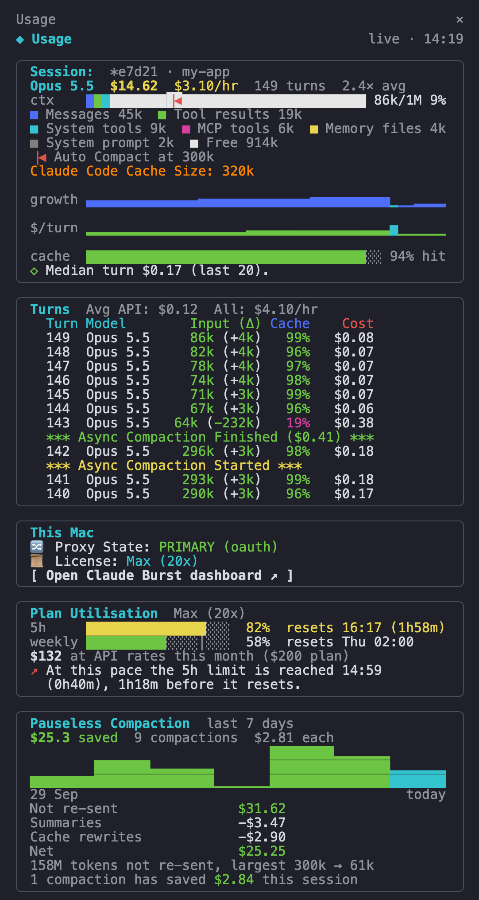

# The dashboard

[Back to the README](../README.md)

This page covers the dashboard's layout, the Sessions and Failover & pricing sections, and how the admin UI is protected.

Claude Burst runs a local dashboard beside the gateway, on port **7788**:

```bash
open http://127.0.0.1:7788
```

It binds loopback only and needs no login (see [the admin UI](#the-local-admin-ui) for how it is protected). Change the address with `claude-burst configure --admin-listen 127.0.0.1:PORT`, turn it off with `--admin-listen off`, or give it a friendlier name with [a friendlier admin URL](#a-friendlier-admin-url).


Three tabs at the top of the menu split the page: **Claude** (Claude Code: everything below), **[Codex](codex.md)** (Codex's routing, plan limits, context per session and requests), and **General** (this Mac and Burst itself: Finder shortcuts, lid and hotspot, notifications, Guards, Audit, Actions, Advanced). A link to a section on another tab, such as a check pointing at Guards, switches to that tab. The tab you last used is remembered.

The menu down the left follows you as you scroll, grouped by job:

- **Observe**: Overview, Activity, Analytics (latency and error rate), Spend by model, **Spend by repository** (each session filed under the repository its Claude Code transcript says it ran in), and [Usage](#usage).
- **Context**: [Pauseless Compaction](compaction.md), Context & cache.
- **Routing**: failover strategy and intercept mode, Secondary, [Failover & pricing](#failover--pricing).
- **Sessions**: [Session handover](handover.md), [Session coordination](coordination.md), [Session options](#session-options-and-the-usage-panel), [Usage panel](#session-options-and-the-usage-panel).
- **Finder shortcuts** (General tab): right-click a folder in Finder, then Services, to open Ghostty there running Claude Code, its last session in that folder (`claude --continue`), a session you pick (`claude --resume`), Claude Code with OMC (`omc`), OMC and Codex side by side (`omc interop`), Codex, OpenCode, or a plain terminal (**Open Ghostty here**). Each has a tick; Install and Remove act on the ticked ones only. A row starts ticked when it is installed or its tool is on this Mac. Install never overwrites a shortcut that is already there. The session, OMC and Codex rows also have **bypass permissions**: ticked, that shortcut starts its tool with `--dangerously-skip-permissions` (Claude Code), `--madmax` (OMC) or `--dangerously-bypass-approvals-and-sandbox` (Codex, which drops its sandbox too). The ticks are lines in `~/.config/claude-burst/finder.conf` that each launcher reads as it starts, so a change needs no reinstall. A launcher changed by hand does not read them and its tick is greyed out. **Launch Claude Code in Ghostty** has no tick: its launcher is the one the usage panel patches, and it follows **Start with bypass permissions** under Session options.
- **This Mac**: [lid closed and hotspot](lid-and-hotspot.md), [Notifications](lid-and-hotspot.md#notifications).
- **Health**: Guards, [Audit](#audit-and-the-support-console), Actions, Advanced (timeouts and limits).
- **Requests**: Responses and Requests, the audit trail of recent traffic.
- **Setup**: Install (shown when Burst is not in use, or from **Reinstall**).

The page follows the same order, most used first, and the menu marks the section you are reading.

Every control section says where it is saved and when it applies, as a chip beside its title: **applies at once**, **applies to the next session**, or **applies after a restart**. Settings the gateway only reads at startup (pricing, fallback models, failover thresholds and strategy, intercept mode, the secondary, timeouts and limits) are compared with the running gateway, and a banner at the top lists any that are saved but not yet in use, with a **Restart the gateway now** button.

A **Needs attention** list above the overview collects everything not doing what it is set to do, each linking to its section: a guard not running, handover hooks half installed, the lid setting not applied as set, another program keeping the Mac awake, a failed usage panel install or removal, and models served without a price.


Screenshots are of a real dashboard with session ids, repository names and dollar figures replaced.

## Usage

**Usage** (Observe menu) is every request in a window you choose, narrowed down with filters. The views above answer fixed questions over whole days; this one answers questions like "the secondary, in this repository, in the last hour, only the failures".

- **Filters**: window (last hour, 24 hours, 7 days, 30 days, or a custom range up to 92 days), model, provider (the primary or secondary slot, or a route such as `anthropic`), repository, session, result and traffic. Traffic is model requests by default; **All traffic** adds the other calls Claude Code makes through the gateway (Remote Control heartbeats, telemetry, token counts), which have no model, tokens or cost and show their path instead of a model. Your last filter is remembered in this browser.
- **Totals**: requests split into ok, errors and cancelled; success rate (cancelled requests, which are you pressing Esc, are left out); tokens by type; cache hit rate (cache reads as a share of everything the model read); estimated cost; output speed in tokens a second; latency p50 and p95 over successful model requests.
- **Trend**: stacked tokens by type (input, cache read, cache write, output), or requests and errors, or cost. Bars are 5 minutes for the last hour, hourly for 24 hours and local days for 7 and 30 days. Empty bars stay in, because a gap is information.
- **Breakdowns** by model, provider, repository and result: one figure per column (requests, errors, tokens, cost), and a bar with each row's share of the cost (of the requests, for the result split). Hover an error count for its rate. A row that used tokens but costs under a cent shows `<$0.01`. Click a name to filter by it.
- **Requests**: the newest first, 25 a page. Click one for its detail: request and session ids, slot, route, requested model, destination, cache writes, pruning and compaction, limit and note.
- **Prices used for the cost estimate**: the table the costs come from, which is `config.json`'s `pricing` over the built-in prices. Cache rates not set there are derived from the input rate and marked.

Times are local. Status 0 requests are counted as "unknown": they come from before the gateway recorded what it answered. When the log rotation means the window reaches back further than the log, the section says so. The data comes from `GET /api/usage`, which takes the same filters as query parameters.

## Session options and the usage panel


**Session options** (Sessions menu) apply to the next session you start. The first three are carried out by the [usage panel](https://github.com/andrewbakercloudscale/claude-code-cost-sidebar)'s hooks and launcher, so they need it installed, and are saved in `~/.config/claude-panel/options`:

- **Start with Remote Control**: every interactive `claude` starts with `--remote-control`.
- **Name the session after its folder**: new sessions are titled with the repo's folder name instead of "Claude Code". Resumed sessions keep their name.
- **Keep the Mac awake while a session runs**: sessions started from a Finder shortcut or by typing `claude` run under `caffeinate -i`. Stops idle sleep, not the screen turning off and locking, and not lid-close sleep.
- **Keep the screen on too**: `caffeinate -di`, so the screen never turns off or locks while a session is open. Uses more battery.
- **Write a handover when a session closes**: the same switch as in [Session handover](handover.md).
- **Show gateway alerts on screen** (on by default, `CLAUDE_PANEL_ALERTS`): see below. **Send a test alert** shows one.

### Gateway alerts on screen

The usage panel floats the same notice it shows for a pauseless compaction over Claude Code's Ghostty window when the gateway runs into something. It shows only while Ghostty is in front and never takes focus. **Over Codex too:** while the ChatGPT app (where Codex lives) is in front, the support console shows the same alerts over its window with the panel's overlay, claimed the same way, so each alert shows once, wherever you are. Only alerts about Burst as a whole (failover, network, guards, the Codex usage limit, spend, a new release); alerts about one Claude Code session, such as its context nearing compaction, stay over that session's Ghostty. Needs the usage panel installed, and follows its **Show gateway alerts on screen** switch. To check it, **Codex, Test an alert over Codex** asks for a test alert; switch to Codex within 2 minutes and it appears, and the dashboard says when it was shown. Colours: blue for information, green when something is back to normal, amber for a warning, red for an error.

| What | Shown as | Clears with |
|---|---|---|
| Failed over to the secondary (with the reset time and why) | warning | Back on Claude, once every limit has reset |
| A Claude limit hit with no secondary set up | warning | fades |
| 5 or more failed replies (5xx) within 2 minutes; cancelled requests, and failures while the network is offline, do not count | error | Requests are succeeding again, after 2 clean minutes |
| Network offline (DNS failing on this Mac) | error | Network back |
| A secondary key that worked can no longer be read (locked Keychain, deleted key) | warning | Secondary key available |
| Compaction failed, or its summary was dropped | warning | fades |
| Transparent mode: Burst CA no longer trusted, or the `/etc/hosts` redirect missing | error | Transparent mode restored |
| The pf guard or the gateway watchdog logged a problem; its repair is shown only when the problem was | error | the repair |
| Gateway restarting (replies in flight finish first), then Gateway ready; not shown for a restart `scripts/deploy.sh` makes | information | Gateway ready |
| The gateway not answering at all (the panel's own check, 3 polls in a row) | error | Burst gateway back |
| A session's context at its warn level (80% of its Compact at, the repository's own when set; never with compaction off for the repository), once per compaction window, on that session's panel. When no prompt yet leaves enough older history to summarise, it says so (a warning) instead of promising a compaction. Never for Claude Code's one-shot side calls (auto mode's classifier, a recap), which carry a whole conversation in one prompt | information | fades |
| Today's API-equivalent spend through Burst passed the level set beside the switch (0 is off), once a day per level | warning | fades |
| Keep-awake turned itself off (the idle time limit, on battery in plugged-in mode, or a problem); back on is in the audit only, since it follows your own use | warning | fades |
| Another session finished, or had its handover written (not shown on that session's own panel) | information | fades |
| A newer Claude Burst release than the one running, once per version | information | fades |

Information and all clear notices show for 3 seconds, warnings for 8; an error stays until what clears it arrives, or 10 minutes. The same alert repeats at most once in 5 minutes. The gateway writes them to `~/.config/claude-burst/notices.json` (newest 20); the panel shows only those newer than when it started, and with several panels open each alert shows once, on one of them. Every alert shown is also kept in the [audit](#audit-and-the-support-console), in full, with the log around it.

### Audit and the support console

**Audit** (General tab) lists every alert shown on screen and every action taken from the dashboard or the support console (each POST, with whether it worked), newest first, filtered by Problems, Alerts shown or Actions taken. **Log around this** on any entry shows the gateway log from 3 minutes before it to 30 seconds after, without the per-request start and done lines, credentials redacted: for a failover, that is the timeout, the retries and the decision. Kept in `~/.config/claude-burst/audit.jsonl` (rotated at 2 MB, the previous file kept).

The **support console** at http://127.0.0.1:7789/ (`claude-burst console`, its own LaunchAgent) has the same audit, plus which part of Burst is down (the gateway service, its port, the dashboard, the Codex port, a config that does not load), the latest log lines, and **Restart gateway**, **Repair**, **Diagnostic report** and **Turn Burst off**. It loads no provider and survives a broken config, so it answers when the gateway does not. Repair and the report run in a Terminal window, where macOS can ask for your password. Change its address with `console_listen` in `config.json` (`"off"` turns it off).

**Usage panel** (Sessions menu): the companion [usage panel](https://github.com/andrewbakercloudscale/claude-code-cost-sidebar), a live panel beside Claude Code showing the session's cost and burn rate, context used, a row per turn with its context, cache hit rate and cost, and where Burst compacted. On Claude Code 2.1.287 or later it is a mod, drawn as a sidebar inside the session in any terminal; on older versions it is a Ghostty split. The section explains what it installs and shows a masked screenshot.



<sub>The sidebar, with made-up figures.</sub>

- **Install** runs the panel's `claude-panel-setup.sh` from a checkout beside this repo, cloning it first if there is none. It adds scripts to `~/.local/bin`, a block to `~/.zshrc`, and two hooks to `~/.claude/settings.json`.
- **Remove** (click twice to confirm) runs the panel's `claude-panel-uninstall.sh`, which takes all of that out and keeps backups of the files it edits. Removing it also turns off the three session options above.
- One install or removal at a time; its output is shown on the page.
- **Panel settings**: cost alerts in the chat (on or off), the minimum dollar amount before a session alert fires, and the context size that shows a red restart warning (0 turns it off).

**Automask** (beside Context & cache): masks personal data in every request before it leaves the Mac, off by default. Credit cards (Luhn), SA ID numbers, US SSNs, UK NI numbers, IBANs and passport machine-readable lines are on once it is switched on; email, phone, SA bank account and IPv4 are there to switch on. A value gets the same mask for the whole session (`[CARD-1 ...4242]`), each new mask is logged without the value and said once under the prompt and as a pop-up, and it never refuses a request. Saved in `config.json` under `automask`; applies from the next request. See [docs/design/automask.md](design/automask.md).

**Context inspector** (Sessions menu): a session's context item by item, as Burst last sent it: instruction files (each CLAUDE.md and the memory index), skills, built-in and MCP tools, your prompts, Claude's replies and every tool result, each with its tokens and the prompt it arrived with. Flagged: tool output over 20 KB from ten or more prompts ago, a file read again later (the old copy is out of date), a file that no longer exists, an instruction file from outside the repository, personal data. Click an item for its full text. The latest request of each conversation is kept in the gateway's memory only, never on disk, and is gone after a restart.

**Remove and Restore.** An instruction file, the skills list, a reminder or a tool result can be removed from a session's context: Burst leaves it out of every later request of that session, with a one-line note in its place ("Removed from this context by the user in Claude Burst: <name>, <size>. Ask them if you need it again."), so the model knows something was there. Claude Code keeps its own copy of the history, so **Restore** simply stops leaving it out. The system prompt, tools, your prompts and Claude's replies cannot be removed: a reply's thinking is signed and a prompt is the conversation itself. A tool result keeps its place, so its call still pairs with it; only the content becomes the note. Removing or restoring changes everything after that point for the prompt cache, so the next request is a one-off cache write. Removals are applied after Burst's own compaction, so they never change what it summarises or its hashes. They are kept in `~/.config/claude-burst/context-removals.json` (ids, names and sizes only, never content) so a restart keeps them, and a session not touched for 14 days is dropped. The same inspector, with the same Remove and Restore, is on the Codex tab for Codex sessions.

**In-session band** (Sessions menu): the `burst-session` Claude Code mod, a line above Claude Code's own prompt with Burst's route, the context Burst really sends, its compaction state, any problem still standing, and the usage panel's Session and Today rows. Under it, a context bar: the context Burst sends split into system prompt, tools, MCP tools, memory files, messages and tool results, against the compaction limit (measured from the request Burst sent, so it counts Burst's own compaction; `/context-bar` hides or shows it). `/burst` opens a pane with the panel's whole summary. Where the usage panel's sidebar mod is installed (`~/.config/claude-panel/mod-installed` exists), the sidebar draws this itself (its session ctx bar becomes the context bar, and standing problems sit under Proxy State), so nothing is drawn above the prompt, and nothing is added to Claude Code's status line. `/burst band` puts the band back, or takes it away again, and the choice is kept. The section says whether it is installed and current (the installed copy matches `mods/burst-session`), installs, updates or removes it through `scripts/update-mod.sh` (every upgrade of Burst runs it, and the usage panel's updater, whichever button or script started the upgrade; the mod was called `burst-band` until 0.19.1, and an update removes that one), and has **Alerts and compaction lines as toasts in the session** (on by default, saved in `~/.config/claude-burst/mod.json`). With it on, a session that has the mod shows Burst's alerts and Pauseless Compaction's lines as toasts inside Claude Code, each once: the mod claims an alert the way the usage panels do (a folder per event in `~/.config/claude-panel/alerts-claimed`), so the Ghostty pop-up for it stands aside, and a pop-up that got there first is not toasted; compaction lines are taken from the same queue the prompt-notice hook reads, so a toasted line is not printed under the prompt. An alert about no one session is toasted in every session that has the mod. Sessions without the mod, and alerts raised while no session is open, still get the pop-up and the line under the prompt. Turn it off where the mod cannot draw (Remote Control): everything is then as it was without the mod. **Hand Burst's summary to Claude Code** (on by default, `handoff` in the same file): Claude Code's own compaction, typed or automatic, is answered with the summary Burst already wrote, with no summary request, and a session that has left Burst holding 300k or more is compacted that way once, by itself ([hand-off](compaction.md#hand-off-claude-code-takes-bursts-summary)). A session opened again (`--resume`, `--continue`) that Burst had summarised is compacted that way as it opens, in the path or not. `/compact-async-full` does the same on request, at any size, and is never Claude Code's own compaction. **Also from 800k held, with Burst still in the path** (on by default, `handoff_in_path` in the same file) compacts a session that way while Burst is working normally, because past the 1M window a bypass is refused; it can be turned off since the turn after it is read uncached and the replaced messages cannot be brought back into the session (Claude Code's transcript file on disk keeps them). It needs Claude Code 2.1.287 or later and does not draw over Remote Control. The mod also adds two rescue commands that work while the gateway is down, because neither makes a request: `/claude-burst-revert` runs `burst-off` (Burst out of the path, Claude Code straight to Anthropic) and `/claude-burst-reinstall` runs `burst-reinstall` (the newest Burst from GitHub, installed again in the mode `config.json` names). Each opens a Terminal window, where macOS can ask for your password.

## Failover & pricing


Routing menu, saved in `config.json`, applies after a restart (the banner offers it):

- **When Anthropic is failing**: the `metered_failover` window, error responses and connection failures, each marked when changed from its default, with **Reset to defaults**.
- **Fallback models**: `fallback_chain`, one line per model (`requested model: fallback, next fallback`), tried on your subscription before the paid secondary.
- **Prices**: every model with a price, plus every model served in the last 30 days, **unpriced models first**, with requests and spend per model. Add, edit or remove a price (a built-in price can only be reset to its built-in value, since built-ins are merged into every load; an empty cache price is derived from the input price); past requests recorded as unpriced are repriced from their stored tokens once saved.

**Advanced** (Setup menu, collapsed): `reset_grace_seconds`, `unknown_reset_seconds`, `response_header_timeout_seconds` and `max_request_mb`, each marked when changed from its default. The gateway and dashboard addresses and TLS peer logging are shown read only: they change what Claude Code connects to, so they are set with `claude-burst configure` and a reinstall.

## The local admin UI

A local control panel runs alongside the gateway on `127.0.0.1:7788` (disable with
`claude-burst configure --admin-listen off`). It shows routing state, usage, the last 50
requests, and the last 20 upstream responses **with their headers**, the
`anthropic-ratelimit-*` ones are what actually decide failover, so overflow behaviour
becomes debuggable rather than mysterious. It also says whether burst is in the path at
all, and **Test connection** proves it live rather than reading config off disk, which is
not the same question.

**Send test message** (Setup) is a trace route for Claude Code: one tiny real message
(16 tokens on the cheapest model, carrying the credential Claude Code itself last sent, or
its Keychain login) goes down the same path Claude Code's traffic takes, and each hop
reports what it saw: what `api.anthropic.com` resolves to, whether 443 reaches the gateway,
whether Node with `NODE_EXTRA_CA_CERTS` trusts the certificate (run with `node` when it is
installed), the gateway's routing decision and why, the answer (status, latency, model,
request id, first words), the network path to Anthropic's real address (`mtr`, which on
macOS needs a setuid `mtr-packet`), and any failover. The secondary is optional, so a
missing one is a grey skipped hop, never a failure.

The readiness check **Claude Code accepts the gateway's certificate** counts the TLS
listener's own handshakes: it fails when 30 or more failed in the last 5 minutes and they
outnumber the ones that completed. Every other check is the gateway looking at itself, and
the gateway trusts its own CA, so on 2026-10-02, when a deploy rotated the CA and every
running session refused it, the page still said 6/6. Restart sessions started before the
CA changed; each reads `NODE_EXTRA_CA_CERTS` only at startup.

What the buttons do: force or clear overflow; change the secondary model, failover strategy
and intercept mode; edit failover thresholds, fallback models, prices and timeouts; set the
lid-closed mode, the hotspot and notifications; install or remove the usage panel and set
its options; restart the gateway (routing config is only read at startup); install either
mode; arm either guard and read its log; read the gateway's own log. Anything needing root
or affecting the whole machine is **not** done in-process, the button writes a script and
opens it in Terminal, where you answer the sudo prompt and watch every command. That
includes **Revert**, which runs `scripts/rollback.sh`: it undoes the machine-wide redirect
too, not just Claude Code's endpoint, because a revert button that cannot undo the widest
change it is offered for is not a revert button.

It binds loopback and has no login, which is not by itself safe: a malicious page can point
a hostname it controls at `127.0.0.1` and drive the UI from your own browser. Two defences
apply to every request, the `Host` header must name loopback, and mutating requests must
carry a custom header, which forces a CORS preflight the server never answers. Response
headers are held in memory only and filtered through an allowlist; request rows are
metadata only, never prompt or response content.

## A friendlier admin URL

```bash
sudo scripts/transparent-root.sh admin-host cloudscale-claudeburst.test
claude-burst configure --admin-hostname cloudscale-claudeburst.test
launchctl kickstart -k gui/$UID/ninja.andrewbaker.claude-burst
```

Then the panel is at <http://cloudscale-claudeburst.test:7788>. Use a **dotted** name -
browsers treat a single-label name as a search term, and `.test` is reserved by RFC 6761 so
it can never collide with a real domain. Undo with
`sudo scripts/transparent-root.sh admin-host-remove` and
`claude-burst configure --admin-hostname off`.

This is a separate `/etc/hosts` block from transparent mode's, so removing one never
disturbs the other.

Be aware of the trade. The `Host` header check is a DNS-rebinding defence, and a hostname a
hostile page can guess and navigate to weakens it. What still holds: mutating requests
require a custom header, so a cross-origin page needs a preflight this server never answers,
and no CORS headers are ever returned, so responses cannot be read cross-origin. A hostile
page could therefore fire read-only requests but not see the answers.
