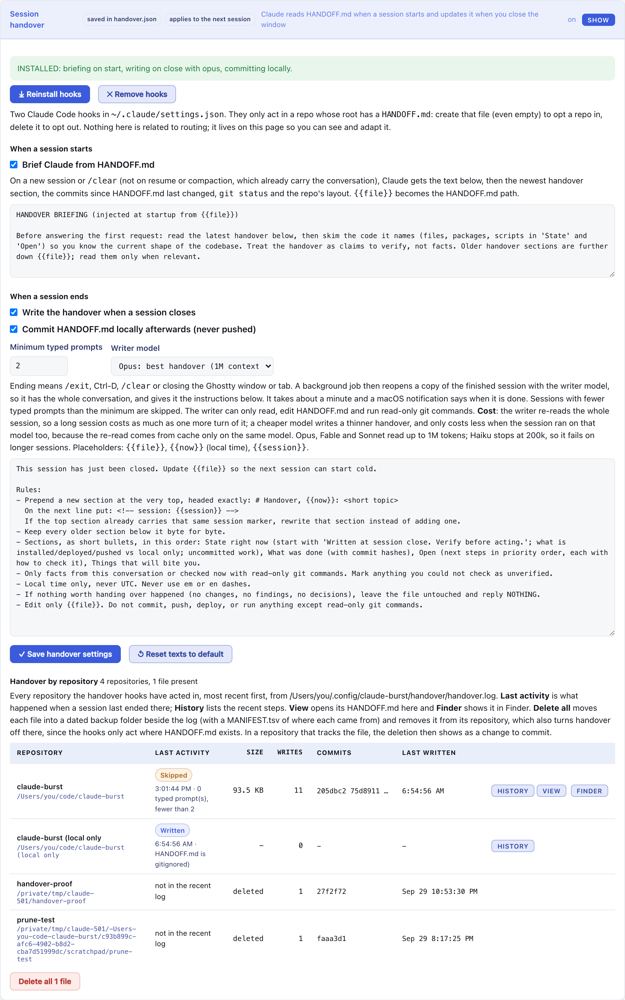
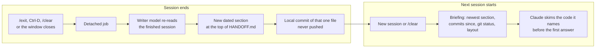

# Session handover: HANDOFF.md read at start, written at close

[Back to the README](../README.md)





Two Claude Code hooks, installed and adapted from the dashboard's **Session handover** section. They only act in a repo whose git root has a `HANDOFF.md`: create one (even empty) to opt a repo in.

**Keep it local in a public repository.** Handover notes can name private repositories, machines and work in progress. Add `HANDOFF.md` to `.gitignore` and the hooks still read and write it, but never commit it: the writer skips the commit for an ignored file, and the briefing measures "commits since" from when the file was last written instead of its last commit.

- **SessionStart** (new session or `/clear`): Claude is given a briefing, the newest handover section, the commits since `HANDOFF.md` last changed, `git status` and the repo's layout, and told to skim the code it names before answering.
- **SessionEnd** (`/exit`, Ctrl-D, `/clear`, or closing the Ghostty window, which Claude Code reports as reason `other`): a detached job (`setsid`, so the window's SIGHUP cannot kill it) resumes a fork of the finished session with the writer model, has it prepend a dated section to `HANDOFF.md`, and commits that one file locally (unless it is gitignored, or auto-commit is off). It never pushes. Sessions with fewer typed prompts than the minimum are skipped, and so is a session with nothing worth handing over. An on-screen alert in the usage panel says when it is done.

The dashboard edits the briefing text, the writer's instructions, the writer model, the minimum prompts and whether to commit, and shows the log. Settings: `~/.config/claude-burst/handover.json` (defaults stored as empty, so they follow new defaults). Scripts, the settings they read, the log and the writer's last reply: `~/.config/claude-burst/handover/`. The scripts are embedded in the binary and rewritten when they differ, so edit `internal/handover/scripts/`, not the installed copies.

## On the dashboard

| Control | What it does | Default |
| --- | --- | --- |
| **Reinstall hooks**, **Remove hooks** | Puts the two hooks in `~/.claude/settings.json`, or takes them out | installed from the dashboard |
| **Brief Claude from HANDOFF.md** | The start hook, and the text Claude is given | on |
| **Write the handover when a session closes** | The end hook | on |
| **Commit HANDOFF.md locally afterwards** | One local commit of that file, never pushed, skipped when the file is gitignored | on |
| **Minimum typed prompts** | Shorter sessions are skipped | 2 |
| **Writer model** | The model that writes the section | Opus |
| Writer's instructions | The rules for the section, with `{{file}}`, `{{now}}` and `{{session}}` filled in | built in |
| **Handover by repository** | Each repository the hooks acted in: last activity, size, writes, commits, with **History**, **View**, **Finder** and **Delete all** | |

The section's header says in one line what is installed. A half-installed pair of hooks is listed under **Needs attention** at the top of the dashboard.

## What a section looks like

```markdown
# Handover, 2026-10-07 14:20: retries for the order export
<!-- session: 4c1e9a02-... -->

## State right now
- Written at session close. Verify before acting.
- Pushed: retry with backoff in src/orders/export.ts. Local only: the config flag.

## What was done
- a1b2c3d: three attempts with backoff

## Open
- Make the backoff configurable. Check: make test

## Things that will bite you
- The export test needs the queue stub running.
```

Older sections stay below it, byte for byte.

**Cost**: the writer re-reads the whole session, so a long session costs about one more turn of it. Pick a cheaper writer model to spend less.
