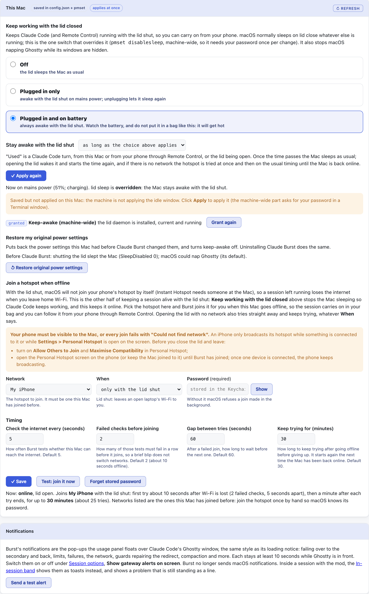
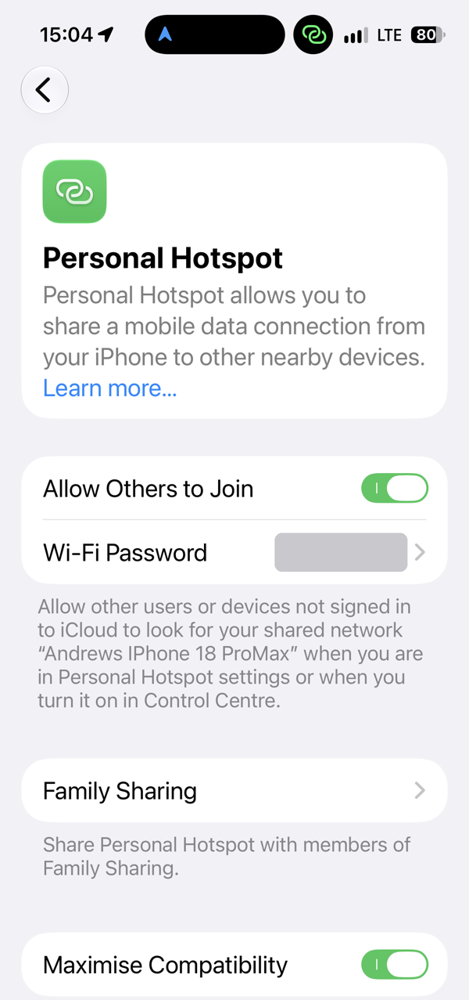

# Lid shut, hotspot and notifications

[Back to the README](../README.md)



## Keeping Claude Code working with the lid shut

Off by default. `keep_awake_lid_closed` in `config.json` keeps a Claude Code session in Ghostty running, and Remote Control reachable, after you close the lid. `keep_awake_lid_closed_power` picks when:

| `keep_awake_lid_closed_power` | Lid shut, plugged in | Lid shut, on battery |
| --- | --- | --- |
| `ac` **(default)** | stays awake | sleeps as normal |
| `always` | stays awake | stays awake |

**Only while in use** (`keep_awake_idle_minutes`, 0 by default): either mode can be limited to a set time after you last used it, so a session you walked away from does not keep a closed laptop awake all night. "Used" is a Claude Code turn (from the Mac or from your phone through Remote Control) or the lid being open. Once the time passes, closing the lid sleeps the Mac as usual; opening it wakes the Mac, starts the time again, and tries the hotspot at once if there is no network. The dashboard offers 30 minutes to 8 hours and shows until when the Mac stays awake. The gateway touches `~/.config/claude-burst/last-activity` on each turn, and the root daemon, which checks every minute, reads only that file's time and only at that path.

```bash
claude-burst configure --keep-awake-lid-closed true                 # mode ac
claude-burst configure --keep-awake-idle-minutes 60                 # awake for an hour after last use
claude-burst configure --keep-awake-power always                    # switch mode
claude-burst configure --keep-awake-lid-closed false                # undo
sudo scripts/lid-awake-root.sh apply ac                             # printed for you if sudo is not cached; ./install.sh re-applies it from config.json
```

- **`pmset -a disablesleep 1`** (root), the only switch that overrides clamshell sleep; `caffeinate` and `pmset sleep 0` do not. The prior value is recorded and restored by `remove`.
- **Mode `ac` needs a root LaunchDaemon** (`ninja.andrewbaker.claude-burst-lidawake`): SleepDisabled is one global value with no per-power-source form, so the daemon follows `pmset -g pslog` and sets it on plug-in and unplug. It runs a root-owned copy in `/usr/local/libexec/claude-burst`; re-run `apply` after editing the script. Log: `/var/log/claude-burst-lidawake.log`.
- **The screen goes off behind the shut lid.** Keeping the Mac awake also kept the built-in screen lit behind the lid, using power and warming it for nobody. Within about a second of the lid shutting, the daemon turns the display off (`pmset displaysleepnow`: display sleep only, Claude Code keeps running), and again if anything wakes it. Not while an external monitor is connected, since that is clamshell mode with someone at the monitor. The daemon therefore runs in both modes. Log: `/var/log/claude-burst-lidawake.log`: every closing is logged ("lid shut seen") with what it decided and why, then "screen off".
- **Ghostty App Nap off** (`NSAppSleepDisabled`, no root), with the lid shut every window is occluded, which is when macOS throttles the app. Takes effect on Ghostty's next launch.
- `claude-burst status` shows the flag, the mode, the power source and the machine's actual state, and flags drift either way.

With `always`, a closed laptop never sleeps: on battery in a bag that means heat and a flat battery. That is why `ac` is the default.

`./install.sh` applies whatever `config.json` says (nothing at all when `false`), and `./install.sh uninstall` removes the daemon and restores the prior sleep setting. Check it is live with `claude-burst status`:

```text
keep awake lid closed: on, mode ac (now on AC: SleepDisabled on, Ghostty App Nap disabled on)
```

Any line starting `->` beneath it is drift, with the command that fixes it.

**From the dashboard** (This Mac, Lid & hotspot): select **Off**, **Plugged in only** (`ac`) or **Plugged in and on battery** (`always`, asks you to confirm), then click **Apply**; selecting alone changes nothing. Apply saves `config.json`, sets Ghostty's App Nap, and applies the root half with cached sudo or in a Terminal window that asks for your password. It shows the live state (power source, battery, whether lid sleep is overridden) and anything not applied as set.

It also lists **other programs keeping this Mac awake**: any process holding a `PreventSystemSleep` assertion (for example `caffeinate -s`) keeps a closed laptop awake on battery whatever this setting says. The idle assertions `caffeinate -i` takes, which Claude Code holds, do not, so they are not listed.

## Join a hotspot when offline

With the lid shut macOS does not join a phone's hotspot by itself (Instant Hotspot is driven from the Wi-Fi menu while someone is at the Mac), so a session left running loses the internet when you leave home Wi-Fi. Off by default.

- **Pick the network** from a dropdown of the networks this Mac has joined before (`networksetup -listpreferredwirelessnetworks`). Join the hotspot once by hand first, so macOS has its password.
- **When**: only with the lid shut (default), or any time this Mac is offline.
- **Offline means unreachable**, not "on the wrong network": a TCP connect to port 443 of Cloudflare (`1.1.1.1`), Google (`8.8.8.8`), Quad9 (`9.9.9.9`) and OpenDNS (`208.67.222.222`) at once, any one answering counts as online, by address, so the `/etc/hosts` redirect does not affect it. The SSID is not checked because since macOS 14.4 `networksetup -getairportnetwork` reports "not associated" to processes without Location access even while connected.
- **Timing**, all on the dashboard under Timing, with a line that adds them up in words as you type:
  - **Check the internet every** 5 seconds (2 to 120).
  - **Failed checks before joining**: 2 (1 to 10), so the first try is about 10 seconds after Wi-Fi is lost.
  - **Gap between tries**: 60 seconds after each try ends (15 to 1800; below 15 a phone is hammered).
  - **Keep trying for**: 30 minutes from the first try (up to 1440). The last try that fits turns Wi-Fi off and on if the Mac is still offline. It starts over once the Mac is back online.
  - The watcher re-reads these at every check, so Save applies them with no restart.
- **Opening the lid with no network** tries the hotspot at once, whatever **When** says and even after the watcher has given up, then starts a fresh spell.
- **If the phone's mobile data drops** while the Mac is still joined to its hotspot (an iPhone hotspot address, 172.20.10.x), the watcher waits rather than joining again: a join would drop the Mac off the phone, and an iPhone with nothing connected stops broadcasting.
- **If the hotspot itself drops**, the watcher starts again within about 10 seconds. It can only rejoin while the phone is broadcasting: an iPhone hides its hotspot once nothing is connected and its Personal Hotspot screen is closed, and every try then fails with "Could not find network" until the phone shows it again.
- **Password**: required, stored in the login Keychain as service `claude-burst-hotspot`. Without it macOS refuses a join made by a background process (error -3900) even for a network it knows, so Save refuses a network with no password. **Show** beside the field unmasks a typed password, or reads the stored one after Touch ID, to check it by eye. The field is not a browser password field, so Chrome does not offer to save it.
- **On an iPhone**, turn on **Allow Others to Join** in Personal Hotspot, or the network is not visible to a Mac nobody is using.
- **Keep the phone's Personal Hotspot screen open until the Mac joins.** With nothing connected, an iPhone only broadcasts its hotspot while that screen is open (or just after you turn it on in Control Centre), as its own caption says. So when you shut the lid somewhere with no Wi-Fi, open **Settings, Personal Hotspot** on the phone and leave it on screen: the Mac's first try comes about 10 seconds after it goes offline, then one a minute for 30 minutes. Once the Mac shows as connected (the green link icon in the phone's status bar) you can lock the phone; the hotspot stays up while something is joined.

  
- **Test: join it now** opens a checklist of what to set on the phone first, and will not start without a password. The test then tries up to **3 times**, 5 seconds apart, showing each attempt as it happens, to join the network selected in the dropdown, saved or not, and reports each step: the join, internet through it, and after a failure getting back on a network (Burst turns Wi-Fi off and on if macOS has not rejoined within ten seconds). Failures say what to do: not found means the phone is not broadcasting; error -3900 usually means a wrong password, so press Show to check it.
- Log: `~/.config/claude-burst/hotspot.log`, also shown on the page.

## Notifications

Burst's notifications are the pop-ups the usage panel floats over Claude Code's Ghostty window, in the same style as its loading notice: failover to the secondary and back, limits, failures, the network, guards repairing the redirect, compaction and the rest listed under [Dashboard](dashboard.md). Each stays at least 10 seconds while Ghostty is in front (warnings 15, errors until they clear); the clock stops while another app is in front. Switch them on or off under **Session options, Show gateway alerts on screen**, and use **Send a test alert** to see one.

Burst no longer sends macOS notifications. They came from Script Editor, which macOS drops silently until it has been allowed to notify, so they looked broken for most people.
